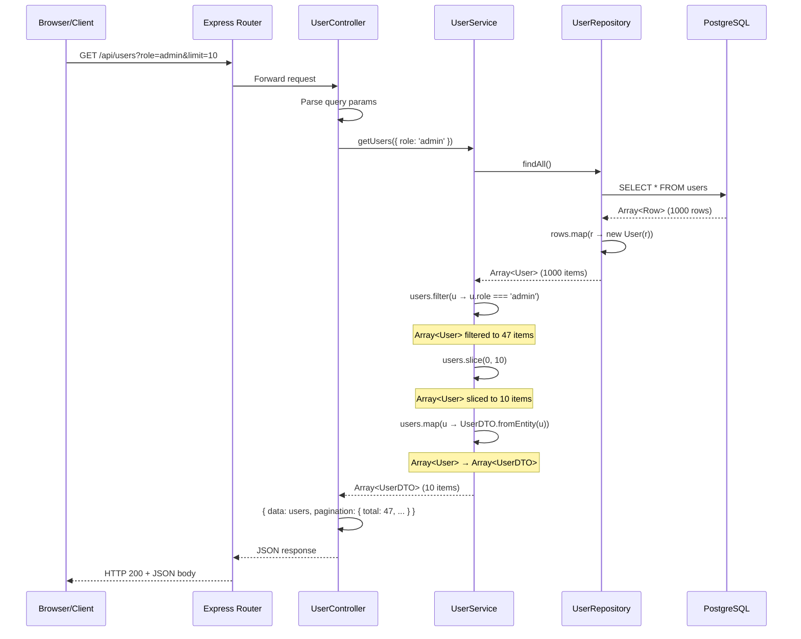

# Arrays in JavaScript — Complete Production Reference

---

## 1. Executive Summary

**What is it?**
An Array in JavaScript is a dynamic, zero-indexed, ordered collection of elements that can hold values of any type (mixed types allowed). It is technically a special kind of object with numerical keys and a built-in `length` property.

**Why was it introduced?**
JavaScript was created in 10 days (1995) by Brendan Eich. Arrays were needed as a fundamental data structure for storing ordered lists — the same need every programming language addresses. Unlike early languages, JS arrays were designed from the start to be dynamic (no fixed size) and heterogeneous (mixed types).

**What problem does it solve?**
- Ordered storage and retrieval of multiple values
- Iteration over collections
- Stack and queue operations (push/pop/shift/unshift)
- Data transformation (map, filter, reduce)
- Working with lists of DOM elements, API responses, user data

**When should we use it?**
- Storing lists of items (users, products, messages)
- Collecting sequential data (logs, time series)
- Implementing stacks, queues, or buffers
- Transforming data with functional methods
- When you need indexed access by position

**When should we avoid it?**
- When you need key-value lookups by string keys → use `Map` or `Object`
- When you need unique values → use `Set`
- When you need frequent insertions/deletions in the middle → consider `LinkedList` pattern
- When you work with very large, sparse arrays → performance degrades
- When you need strict typed collections → use `TypedArray` (Int32Array, Float64Array, etc.)

---

## 2. First Principles

JavaScript Arrays build on these fundamental concepts:

### Memory as a Sequence
At the lowest level, computer memory is a sequence of addressable cells. An array represents a contiguous block of these cells (in theory), where each element is at `base_address + index * element_size`.

### JavaScript's Twist
Unlike C or Java, JS arrays are **not** true contiguous memory blocks. They are objects that map integer keys to values, backed by the engine (V8, SpiderMonkey) with optimizations:

- **Packed/ dense arrays**: Elements are stored contiguously in memory (fast path)
- **Sparse/ holey arrays**: Missing indices cause performance penalties (slow path)

### The `length` Property
`length` is not the count of elements — it's the **largest index + 1**. Setting `length` truncates or extends the array.

```js
const arr = [10, 20, 30];
arr.length; // 3
arr[10] = 100;
arr.length; // 11 (sparse!)
```

### Prototype Chain
Every array inherits from `Array.prototype`, which provides methods like `map`, `filter`, `reduce`, `push`, `pop`, `slice`, `splice`, etc.

```
arr → Array.prototype → Object.prototype → null
```

---

## 3. Real World Analogy

**The Parking Lot Analogy**

Imagine a multi-story parking lot with numbered spots (0, 1, 2, 3, ...).

| Parking Lot Concept | JavaScript Array Concept |
|---|---|
| Spot number | Index (0-based) |
| Car in a spot | Element value |
| Total spots | `length` property |
| Empty spots between cars | Sparse array (holes) |
| Valet parking a car at the end | `push()` |
| Removing the last car | `pop()` |
| Removing the first car (everyone shifts down) | `shift()` |
| Inserting a car at the front (everyone shifts up) | `unshift()` |
| Rows of cars | Multi-dimensional arrays (nested) |
| Adding a new floor (extension) | Dynamic resizing |
| Drone view of all cars | `forEach()` or iteration |
| Finding a red car | `find()` or `filter()` |

**Real-world map:**
```
Parking Lot (Array)
┌─────┬─────┬─────┬─────┬─────┬─────┬─────┐
│  0  │  1  │  2  │  3  │  4  │  5  │  6  │  ← Indexes
├─────┼─────┼─────┼─────┼─────┼─────┼─────┤
│ 🚗  │ 🚙  │ ❌  │ 🚕  │ ❌  │ ❌  │ 🚌  │  ← Elements (❌ = holes)
└─────┴─────┴─────┴─────┴─────┴─────┴─────┘
  ↑                         ↑            ↑
 arr[0]                   arr[4] is empty  arr[6]
                         (undefined)
```

---

## 4. Comparison Table

| Feature | JavaScript Array | TypedArray (e.g., Int32Array) | Linked List (Manual) | Set | Object |
|---|---|---|---|---|---|
| **Type safety** | No (mixed types) | Yes (fixed type) | N/A (manual) | No (mixed) | No |
| **Dynamic size** | Yes | No (fixed length) | Yes | Yes | Yes |
| **Indexed access** | O(1) average | O(1) | O(n) | No | O(1) via keys |
| **Insert/delete start** | O(n) (shift/unshift) | O(n) | O(1) (with head ref) | O(1) average | N/A |
| **Insert/delete end** | O(1) amortized (push/pop) | N/A | O(n) (without tail) | O(1) | N/A |
| **Insert middle** | O(n) | O(n) | O(1) (with ref) | N/A | N/A |
| **Search** | O(n) | O(n) | O(n) | O(1) average | O(1) average |
| **Memory** | Moderate (object overhead) | Low (raw binary) | High (node pointers) | Moderate | Moderate |
| **Iteration** | Yes (indexed) | Yes (indexed) | Yes (traversal) | Yes (insertion order) | Yes (keys/values) |
| **JSON serializable** | Yes | No (manual) | No | Yes | Yes |
| **Spread operator** | Yes | Yes (via Array.from) | No | Yes | Yes |
| **When to use** | General collections | Binary data, WebGL, audio | Frequent middle insertions | Unique values | Key-value maps |
| **When NOT to use** | Unique checks, binary data | General collections | Random access needed | Ordered data | Ordered data, arrays |

---

## 5. Problem Statement

### What problem existed before?
Early JavaScript (ECMAScript 1, 1997) had arrays, but they were rudimentary. Developers managing collections had limited methods — no `map`, `filter`, or `reduce`. Loops and manual mutation were the only tools.

### Why did previous approaches fail?
- Manual iteration with `for (var i = 0; i < arr.length; i++)` was verbose and error-prone
- Mutation of arrays in-place caused subtle bugs in shared state
- No functional programming primitives led to callback-heavy spaghetti code
- No immutability support caused difficult-to-track state mutations

### Why did this solution become popular?
- **ES5 (2009)**: Added `map`, `filter`, `reduce`, `forEach`, `indexOf`, `every`, `some` — transformed JavaScript into a functional language
- **ES6 (2015)**: Added `find`, `findIndex`, `from`, `of`, spread operator, destructuring — made array operations concise and expressive
- **ES2019+**: `flat`, `flatMap`, `Array.prototype.flat`, `Object.fromEntries`
- **ES2023**: `toSorted`, `toReversed`, `toSpliced`, `with` — immutable versions of mutating methods

The shift from imperative to declarative array manipulation made code more readable, testable, and less bug-prone.

---

## 6. Internal Working

### V8 Engine Optimization (Hidden Classes & Elements Kinds)

V8 classifies arrays into **Elements Kinds** based on content type and sparsity. Degradation is one-way — once downgraded, never upgrades.

```
PACKED_SMI_ELEMENTS       → [1, 2, 3]          (Small Integers — fastest)
    ↓ (add a float)
PACKED_DOUBLE_ELEMENTS    → [1, 2.5, 3]        
    ↓ (add a string)
PACKED_ELEMENTS           → [1, 2.5, "hello"]  
    ↓ (create a hole)
HOLEY_ELEMENTS            → [1, , 3]            (slowest)
```

**Performance degradation:**
- Holey arrays require prototype chain lookups for holes
- Each method (map, forEach) must check every index for "hole" status
- Adding mixed types forces deoptimization

### Memory Layout

**Dense array (fast):**
```
[Header] [elt0] [elt1] [elt2] [elt3] ...  → Contiguous buffer
```

**Sparse array (slow):**
```
[Header] → Dictionary (hash map of index → value)
```
> 10x+ slower for operations.

### Lifecycle of `push()`

```js
const arr = [1, 2, 3];  // PACKED_SMI_ELEMENTS, length=3, capacity=4
arr.push(4);             // length=4, fits in capacity → O(1)
arr.push(5);             // length=5, exceeds capacity → O(1) amortized
```

1. Check if capacity > length → yes, store at arr[length]
2. Increment length
3. If no capacity -> allocate new buffer (1.5x growth factor in V8), copy elements

### Growth Factor
V8 uses approximately **1.5x** growth factor (not 2x like C++ vector). This reduces memory waste while maintaining amortized O(1) push.

---

## 7. Architecture Breakdown

When arrays are used in a production application, they flow through these architectural layers:

```
┌─────────────────────────────────────┐
│           UI / Presentation          │  ← Renders list data
│  (React components, Angular views)  │
├─────────────────────────────────────┤
│         Controller / Handler         │  ← Receives request, validates
│  (Express routes, Next.js API)      │
├─────────────────────────────────────┤
│           Service Layer              │  ← Business logic, transformations
│  (map/filter/reduce operations)     │
├─────────────────────────────────────┤
│          Repository / DAO            │  ← Data access, converts DB rows to arrays
│  (SQL queries, ORM calls)           │
├─────────────────────────────────────┤
│            Database / Cache          │  ← Actual data storage
│  (PostgreSQL, Redis, MongoDB)       │
└─────────────────────────────────────┘
```

Each layer may transform the array representation:
- **DB**: Returns row arrays or cursors
- **Repository**: Maps rows to domain model arrays
- **Service**: Filters, sorts, paginates
- **Controller**: Validates array inputs, wraps for response
- **UI**: Iterates for rendering, manages state arrays

---

## 8. End-to-End Walkthrough

**Scenario:** User searches for "laptops" on an e-commerce site, and the API returns paginated results.

### Step 1: User types "laptops" and hits Enter
Browser sends `GET /api/products?q=laptops&page=1&limit=20`

### Step 2: Express Route Handler
```js
app.get('/api/products', (req, res) => {
  const { q, page, limit } = req.query;
  // q = "laptops", page = "1", limit = "20"
});
```

### Step 3: Service Layer
```js
async function searchProducts(query, page, limit) {
  const results = await productRepo.searchByName(query);
  // results is an Array of Product entities from DB
  
  const paginated = results.slice((page - 1) * limit, page * limit);
  // Creates a new array with only 20 items (shallow copy)
  
  const transformed = paginated.map(product => ({
    id: product.id,
    name: product.name,
    price: product.price,
    inStock: product.quantity > 0
  }));
  
  return {
    items: transformed,        // Array<TransformedProduct>
    total: results.length,     // Total count
    page: 1,
    hasMore: results.length > page * limit
  };
}
```

### Step 4: Repository Layer
```js
async searchByName(query) {
  const rows = await db.query(
    'SELECT * FROM products WHERE name ILIKE $1',
    [`%${query}%`]
  );
  // rows is an Array of plain objects from pg driver
  return rows.map(row => new Product(row));  // Map to domain objects
}
```

### Step 5: Response sent as JSON
```json
{
  "items": [
    { "id": 1, "name": "Laptop Pro", "price": 1299, "inStock": true },
    { "id": 2, "name": "Laptop Air", "price": 999, "inStock": false }
  ],
  "total": 47,
  "page": 1,
  "hasMore": true
}
```

### Step 6: Frontend receives array and renders
```jsx
function ProductList({ products }) {
  return (
    <div className="grid">
      {products.map(product => (
        <ProductCard key={product.id} product={product} />
      ))}
    </div>
  );
}
```

---

## 9. Code Walkthrough

### Production Example: User Management System

#### `user.dto.js` — Data Transfer Object
```js
// Defines the shape of user data transferred between layers
class UserDTO {
  constructor({ id, name, email, role, createdAt }) {
    this.id = id;
    this.name = name;
    this.email = email;
    this.role = role;
    this.createdAt = createdAt;
  }

  static fromEntity(user) {
    return new UserDTO({
      id: user.id,
      name: `${user.firstName} ${user.lastName}`,
      email: user.email,
      role: user.role,
      createdAt: user.createdAt.toISOString()
    });
  }
}
```

#### `user.entity.js` — Domain Entity
```js
class User {
  constructor({ id, firstName, lastName, email, role, createdAt }) {
    this.id = id;
    this.firstName = firstName;
    this.lastName = lastName;
    this.email = email;
    this.role = role;
    this.createdAt = createdAt;
  }

  isAdmin() {
    return this.role === 'admin';
  }

  getFullName() {
    return `${this.firstName} ${this.lastName}`;
  }
}
```

#### `user.repository.js` — Data Access
```js
class UserRepository {
  constructor(db) {
    this.db = db;
  }

  async findAll() {
    const rows = await this.db.query('SELECT * FROM users ORDER BY created_at DESC');
    // rows is Array<PlainObject>
    return rows.map(row => new User({       // Transform array
      id: row.id,
      firstName: row.first_name,
      lastName: row.last_name,
      email: row.email,
      role: row.role,
      createdAt: row.created_at
    }));
  }

  async findByIds(ids) {
    if (!Array.isArray(ids) || ids.length === 0) {
      return [];  // Defensive: return empty array for invalid input
    }
    const placeholders = ids.map((_, i) => `$${i + 1}`).join(',');
    const rows = await this.db.query(
      `SELECT * FROM users WHERE id IN (${placeholders})`,
      ids
    );
    return rows.map(row => new User(row));
  }

  async findByRole(role) {
    const rows = await this.db.query(
      'SELECT * FROM users WHERE role = $1',
      [role]
    );
    return rows.map(row => new User(row));
  }

  async batchCreate(users) {
    // users is Array<User>
    const values = users.map((u, i) =>
      `($${i * 4 + 1}, $${i * 4 + 2}, $${i * 4 + 3}, $${i * 4 + 4})`
    ).join(',');

    const params = users.flatMap(u => [u.firstName, u.lastName, u.email, u.role]);
    // flatMap flattens [[fn,ln,em,role], [fn,ln,em,role]] → [fn,ln,em,role,fn,ln,...]

    const result = await this.db.query(
      `INSERT INTO users (first_name, last_name, email, role) VALUES ${values} RETURNING *`,
      params
    );
    return result.rows.map(row => new User(row));
  }
}
```

#### `user.service.js` — Business Logic
```js
class UserService {
  constructor(userRepo, emailService) {
    this.userRepo = userRepo;
    this.emailService = emailService;
  }

  async getActiveAdmins() {
    const allUsers = await this.userRepo.findAll();
    // Chaining array methods — production pattern
    return allUsers
      .filter(user => user.isAdmin())
      .filter(user => user.isActive)
      .sort((a, b) => a.getFullName().localeCompare(b.getFullName()))
      .map(user => UserDTO.fromEntity(user));
  }

  async createUsersBulk(userDTOs) {
    // userDTOs is Array<UserDTO>
    // Validate all before inserting any (fail-fast)
    const errors = userDTOs
      .map((dto, i) => ({ index: i, error: this.validateUser(dto) }))
      .filter(item => item.error !== null);

    if (errors.length > 0) {
      throw new Error(`Validation failed: ${JSON.stringify(errors)}`);
    }

    const entities = userDTOs.map(dto => new User(dto));
    const created = await this.userRepo.batchCreate(entities);

    // Fire-and-forget notifications (don't block on email)
    created.forEach(user => {
      this.emailService.sendWelcome(user.email, user.getFullName())
        .catch(err => console.error(`Failed to email ${user.id}:`, err));
    });

    return created.map(user => UserDTO.fromEntity(user));
  }

  validateUser(dto) {
    const errors = [];
    if (!dto.email?.includes('@')) errors.push('Invalid email');
    if (!['admin', 'user', 'moderator'].includes(dto.role)) errors.push('Invalid role');
    return errors.length > 0 ? errors.join(', ') : null;
  }
}
```

#### `user.controller.js` — HTTP Handler
```js
class UserController {
  constructor(userService) {
    this.userService = userService;
  }

  async getUsers(req, res) {
    try {
      const { role, sort, limit = '50', offset = '0' } = req.query;

      // Validate query params
      const pageSize = Math.min(parseInt(limit, 10), 100); // Cap at 100
      const pageOffset = parseInt(offset, 10);

      let users = await this.userService.getAll();

      // Server-side filtering
      if (role) {
        users = users.filter(u => u.role === role);
      }

      // Pagination using slice (creates new array — safe)
      const paginated = users.slice(pageOffset, pageOffset + pageSize);

      res.json({
        data: paginated,
        pagination: {
          total: users.length,
          limit: pageSize,
          offset: pageOffset,
          hasMore: pageOffset + pageSize < users.length
        }
      });
    } catch (err) {
      res.status(500).json({ error: 'Failed to fetch users' });
    }
  }

  async bulkCreate(req, res) {
    const { users } = req.body;

    if (!Array.isArray(users) || users.length === 0) {
      return res.status(400).json({ error: 'users must be a non-empty array' });
    }

    // Array validation: ensure every element is an object
    const valid = users.every(u => u && typeof u === 'object' && !Array.isArray(u));
    if (!valid) {
      return res.status(400).json({ error: 'Each user must be an object' });
    }

    try {
      const created = await this.userService.createUsersBulk(users);
      res.status(201).json({ created: created.length, users: created });
    } catch (err) {
      res.status(400).json({ error: err.message });
    }
  }
}
```

#### `middleware/array-validator.js` — Array Input Validation
```js
// Reusable middleware for validating array request bodies
function validateArrayBody({ field, minItems = 1, maxItems = 1000 }) {
  return (req, res, next) => {
    const arr = req.body[field];

    if (!Array.isArray(arr)) {
      return res.status(400).json({
        error: `${field} must be an array`
      });
    }

    if (arr.length < minItems) {
      return res.status(400).json({
        error: `${field} must have at least ${minItems} item(s)`
      });
    }

    if (arr.length > maxItems) {
      return res.status(400).json({
        error: `${field} must not exceed ${maxItems} items`
      });
    }

    next();
  };
}

// Usage in routes:
// router.post('/users/bulk', validateArrayBody({ field: 'users', maxItems: 500 }), controller.bulkCreate)
```

---

## 10. Request Pipeline

### Mermaid Diagram: Array Data Flow in a Search Request



### ASCII Version

```
REQUEST FLOW: GET /api/users?role=admin&limit=10

  Client                          Server
    │                                │
    │  ── HTTP GET ──────────────►   │
    │                                ├─ Route matches /api/users
    │                                ├─ Controller.parseQueryParams()
    │                                │   { role: 'admin', limit: 10 }
    │                                │
    │                                ├─ Service.getAll()
    │                                │   │
    │                                │   ├─ Repo.findAll()
    │                                │   │   SELECT * FROM users
    │                                │   │        │
    │                                │   │        ▼
    │                                │   │   ┌──────────┐
    │                                │   │   │   DB     │
    │                                │   │   │ 1000 rows│
    │                                │   │   └────┬─────┘
    │                                │   │        │
    │                                │   │        ▼
    │                                │   │   rows.map(r → new User(r))
    │                                │   │   Array<User> (1000)
    │                                │   │
    │                                │   ├─ .filter(u → u.role === 'admin')
    │                                │   │   Array<User> (47)
    │                                │   │
    │                                │   ├─ .slice(0, 10)
    │                                │   │   Array<User> (10)
    │                                │   │
    │                                │   └─ .map(u → UserDTO.fromEntity(u))
    │                                │       Array<UserDTO> (10)
    │                                │
    │                                ├─ Response: { data: [...], pagination }
    │  ◄── HTTP 200 + JSON ──────── │
    │                                │
```

---

## 11. Data Flow

### Input Transformations

```
Raw Input (JSON array) → Parse → Validated Array → Transformed Array → Output
```

**Example:**
```js
// Raw: "[{\"name\":\"Alice\"},{\"name\":\"Bob\"}]"
const raw = JSON.parse(body);          // Array<Object>
const validated = raw.filter(u => u.name?.length > 0);  // Remove empty
const enriched = validated.map(u => ({
  ...u,
  id: crypto.randomUUID(),
  createdAt: new Date()
}));                                    // Array<EnrichedUser>
```

### Memory Flow for `map()`

```
Source Array (4 elements)          Result Array (4 elements)
┌─────┬─────┬─────┬─────┐        ┌─────┬─────┬─────┬─────┐
│  1  │  2  │  3  │  4  │  map   │  2  │  4  │  6  │  8  │
└─────┴─────┴─────┴─────┘  ───►  └─────┴─────┴─────┴─────┘
  ↑ Each element read           ↑ New array, same length
  ↓ Callback: x => x * 2         Old array unchanged
```

### Mutation vs Immutability Flow

**Mutating (side effects — can cause bugs):**
```js
const users = await getUsers();
users.sort((a, b) => a.age - b.age);   // MUTATES original!
users.push(newUser);                     // MUTATES original!
sendToClient(users);
```

**Immutable (safe — recommended in production):**
```js
const users = await getUsers();
const sorted = [...users].sort((a, b) => a.age - b.age);  // Copy + sort
const updated = [...users, newUser];                        // New array
sendToClient(updated);
```

---

## 12. Production Best Practices

### Coding Practices
```js
// ✅ GOOD: Use descriptive variable names
const activeUsers = users.filter(u => u.isActive);

// ✅ GOOD: Prefer const over let for arrays
const items = [1, 2, 3];
// items = [4, 5, 6]; // ❌ Don't reassign
items.push(4); // ✅ OK — const prevents reassignment, not mutation

// ✅ GOOD: Use functional methods over loops
const result = data.map(transform).filter(predicate).reduce(accumulate);

// ✅ GOOD: Defensive copies when receiving external data
const safeCopy = [...externalArray];

// ❌ BAD: Mutating shared state
function addItem(arr, item) {
  arr.push(item);
  return arr; // Caller's array is now mutated!
}

// ✅ GOOD: Return a new array
function addItem(arr, item) {
  return [...arr, item];
}
```

### Performance Best Practices
```js
// ✅ GOOD: Pre-allocate when size is known
const arr = new Array(1000); // V8 knows it's a dense array from start

// ✅ GOOD: Use typed arrays for numeric heavy-lifting
const buffer = new Float64Array(1000000); // Raw binary — fast

// ❌ BAD: Growing arrays in a hot loop
const result = [];
for (let i = 0; i < 1e6; i++) {
  result.push(compute(i)); // Multiple reallocations
}

// ✅ GOOD: Pre-allocate and fill
const result = new Array(1e6);
for (let i = 0; i < 1e6; i++) {
  result[i] = compute(i); // No reallocation
}

// ✅ GOOD: Cache array length for tight loops
for (let i = 0, len = arr.length; i < len; i++) { ... }

// ❌ BAD: Using shift/unshift in performance-critical paths
while (queue.length) {
  const item = queue.shift(); // O(n) each time — O(n²) total!
  process(item);
}

// ✅ GOOD: Use index pointer instead
let idx = 0;
while (idx < queue.length) {
  process(queue[idx++]);
}
// Or use a proper queue data structure
```

### Security Best Practices
```js
// ✅ GOOD: Validate array inputs
if (!Array.isArray(input)) {
  throw new Error('Expected an array');
}

// ✅ GOOD: Sanitize array elements
const sanitized = input
  .filter(item => typeof item === 'string')
  .map(item => stripHtml(item));

// ❌ BAD: Using array indices for security decisions
if (user.roles[0] === 'admin') { /* grant access */ }
// User might have empty roles array!

// ✅ GOOD: Check array contents defensively
const isAdmin = Array.isArray(user.roles) && user.roles.includes('admin');

// ✅ GOOD: Limit array sizes to prevent DoS
if (req.body.items.length > 1000) {
  return res.status(413).json({ error: 'Too many items' });
}
```

### Error Handling
```js
// ✅ GOOD: Guard against null/undefined
function safeProcess(arr) {
  if (!Array.isArray(arr)) {
    return []; // Fail gracefully
  }
  return arr.map(processItem);
}

// ✅ GOOD: Handle errors in async array operations
async function processAll(items) {
  const results = await Promise.allSettled(
    items.map(item => processItem(item).catch(err => ({ error: err })))
  );
  const successes = results
    .filter(r => r.status === 'fulfilled')
    .map(r => r.value);
  const failures = results
    .filter(r => r.status === 'rejected')
    .map(r => r.reason);
  return { successes, failures };
}
```

### Maintainability
```js
// ✅ GOOD: Name callbacks for readability
const validUsers = users
  .filter(isActiveUser)
  .map(toUserDTO)
  .sort(byName);

// ✅ GOOD: Extract complex predicates
const isEligibleForPromotion = user =>
  user.tenure > 2 &&
  user.performanceRating >= 4 &&
  !user.onProbation;

const promoted = users.filter(isEligibleForPromotion);

// ✅ GOOD: Use Array methods as pure functions
// Pure: same input → same output, no side effects
const double = arr => arr.map(x => x * 2);
```

---

## 13. Common Production Mistakes

### Mistake 1: Mutating arrays in React state
```js
// ❌ BAD: Direct mutation
const [items, setItems] = useState([1, 2, 3]);
items.push(4); // React won't re-render!
setItems(items);

// ✅ GOOD: Create a new array
setItems(prev => [...prev, 4]);
```

### Mistake 2: Using `delete` on arrays
```js
// ❌ BAD: Leaves a hole (sparse array → performance degradation)
const arr = [1, 2, 3];
delete arr[1]; // arr → [1, empty, 3], length still 3!

// ✅ GOOD: Use splice or filter
arr.splice(1, 1); // arr → [1, 3], length = 2
// OR (immutable):
const newArr = arr.filter((_, i) => i !== 1);
```

### Mistake 3: Confusing `splice` with `slice`
```js
// ❌ BAD: Using splice (mutates) when slice (immutable) was intended
const subset = original.splice(0, 5); // MUTATES original!

// ✅ GOOD: Use slice for read-only operations
const subset = original.slice(0, 5); // original unchanged
```

### Mistake 4: Forgetting array methods return new arrays (functional style)
```js
// ❌ BAD: Expecting map/filter to mutate
let items = [1, 2, 3];
items.map(x => x * 2);
console.log(items); // Still [1,2,3]! Map returns a new array.

// ✅ GOOD: Assign the result
const doubled = items.map(x => x * 2);
```

### Mistake 5: Shallow copy confusion
```js
// ❌ BAD: Nested arrays are still referenced
const original = [[1, 2], [3, 4]];
const copy = [...original]; // Shallow copy
copy[0].push(99); // Also modifies original[0]!

// ✅ GOOD: Deep copy for nested arrays
const deepCopy = JSON.parse(JSON.stringify(original)); // Simple but limited
// OR
const deepCopy = structuredClone(original); // Modern, handles more types
```

### Mistake 6: Forgetting that `sort()` mutates and uses string comparison by default
```js
// ❌ BAD: Sorts as strings
const nums = [1, 10, 2, 21];
nums.sort(); // → [1, 10, 2, 21]  (lexicographic!)

// ❌ BAD: Also mutates the original
const sorted = nums.sort((a, b) => a - b); // nums is also sorted now!

// ✅ GOOD: Immutable sort
const sorted = [...nums].sort((a, b) => a - b);
// OR (ES2023):
const sorted = nums.toSorted((a, b) => a - b);
```

### Mistake 7: Using `for...in` on arrays
```js
// ❌ BAD: for...in iterates keys, not values — and includes prototype!
Array.prototype.customProp = 'bad';
const arr = [10, 20, 30];
for (const key in arr) {
  console.log(key); // "0", "1", "2", "customProp"!
}

// ✅ GOOD: Use for...of, forEach, or regular for
for (const value of arr) { ... }
arr.forEach(value => ...);
for (let i = 0; i < arr.length; i++) { ... }
```

### Mistake 8: Not handling sparse arrays
```js
// ❌ BAD: Holes cause unexpected behavior
const sparse = [1, , 3];
sparse.forEach(x => console.log(x)); // 1, 3 (skips hole!)
sparse.map(x => x * 2); // [2, empty, 6]

// ✅ GOOD: Avoid creating holes
const arr = [1, undefined, 3]; // Explicit undefined, not a hole
```

---

## 14. Debugging Guide

### Common Logs & Inspection

```js
// Inspect array contents
console.log('Users array:', JSON.stringify(users, null, 2));

// Check length
console.log(`Found ${users.length} users`);

// Check type
console.log('Is array?', Array.isArray(users)); // true/false

// Check for holes
console.log('Has holes?', !Object.keys(users).every(k => k in users));
// OR: check if indices are contiguous

// Debug chained method calls
const result = users
  .map(u => { console.log('map:', u.id); return transform(u); })
  .filter(u => { console.log('filter:', u.id); return predicate(u); });
```

### Debugging Checklist

| Symptom | Likely Cause | Fix |
|---|---|---|
| `arr.map is not a function` | Variable is not an array | `Array.isArray(arr)` check |
| Length unexpectedly large | Holes or sparse array | Check for `delete` usage |
| Wrong sort order | Default string sort | Provide comparator: `sort((a,b) => a-b)` |
| Unexpected mutations | Reference sharing | `[...arr]` shallow copy |
| React not re-rendering | Direct mutation | New array reference needed |
| Slow performance | Holey array or mixed types | Keep types consistent |
| `undefined` elements | Out-of-bounds access | Check index bounds |
| JSON.stringify fails circular | Array contains circular refs | Use `util.inspect` or custom serializer |

### Common Exceptions

```
TypeError: items.map is not a function
  → items is null/undefined or not an array
  → Fix: Guard with Array.isArray() before calling array methods

RangeError: Invalid array length
  → new Array(negative) or new Array(too large > 2^32-2)
  → Fix: Validate the length value

TypeError: Cannot read properties of undefined (reading '...')
  → Accessing an element that doesn't exist (arr[999] on a length-10 array)
  → Fix: Check bounds or use optional chaining arr[i]?.property
```

### Production Debugging with Node.js

```js
// Use the built-in inspector
// node --inspect app.js
// Then open chrome://inspect

// Heap dump to find large arrays
const { writeHeapSnapshot } = require('v8');
writeHeapSnapshot(); // Generates a .heapsnapshot file

// Memory usage
const used = process.memoryUsage();
console.log(`Array operations using ${used.heapUsed / 1024 / 1024} MB`);
```

---

## 15. Performance Considerations

### Time Complexity

| Operation | Array | TypedArray | Notes |
|---|---|---|---|
| Access by index | O(1) | O(1) | Fastest operation |
| Search (unsorted) | O(n) | O(n) | Use `Set` for O(1) lookups |
| Search (sorted, binary) | O(log n) | O(log n) | Must manually implement |
| Push (amortized) | O(1) | N/A (fixed) | May trigger reallocation |
| Pop | O(1) | N/A | Fast |
| Shift | O(n) | O(n) | Every element re-indexed |
| Unshift | O(n) | O(n) | Every element re-indexed |
| Splice (middle) | O(n) | O(n) | Shifts elements |
| Slice | O(n) | O(n) | Creates new array |
| Map/Filter/Reduce | O(n) | O(n) | Creates new array (except reduce) |
| Sort | O(n log n) | O(n log n) | TimSort in V8 |
| forEach | O(n) | O(n) | Callback overhead |

### Space Complexity

- **Dense array**: O(n) — elements stored contiguously
- **Sparse array**: O(k) where k is number of defined entries — stored as dictionary
- **Array overhead**: ~40 bytes per array + 8 bytes per element reference (on 64-bit)
- **Growth factor buffer**: ~50% extra capacity on average due to 1.5x growth

### V8 Specific Optimizations

```js
// FAST PATH: Monomorphic arrays
const arr = [1, 2, 3];        // PACKED_SMI_ELEMENTS
arr.map(x => x + 1);          // Optimized by TurboFan

// SLOW PATH: Polymorphic
const mixed = [1, 'hello', true]; // PACKED_ELEMENTS (slower)

// Degradation is ONE-WAY:
const arr = [1, 2, 3];        // Packed Smi (fastest)
arr.push(4.5);                // → Packed Double (slower)
arr.push('x');                // → Packed (even slower)
arr[10] = 5;                  // → Holey (slowest — never recovers)
```

### Performance Benchmarks (Approximate, V8/node 20)

```
Operation           1,000 items   100,000 items   1,000,000 items
─────────────────────────────────────────────────────────────────
for loop            0.01 ms       0.5 ms          5 ms
forEach             0.02 ms       1 ms           10 ms
map (new array)     0.03 ms       2 ms           20 ms
filter              0.03 ms       2 ms           20 ms
reduce              0.02 ms       1.5 ms         15 ms
push (1 item)       0.001 ms      0.001 ms       0.001 ms
shift (1 item)      0.1 ms        5 ms           500 ms (O(n)!)
```

### Optimization Techniques

```js
// 1. Avoid spread in hot paths
// ❌ BAD (creates array copy each time)
const doubled = [...arr].map(x => x * 2);

// ✅ GOOD (just use map directly)
const doubled = arr.map(x => x * 2);

// 2. Use for loop for max performance
let sum = 0;
for (let i = 0; i < arr.length; i++) sum += arr[i];

// 3. Use typed arrays for numeric data
const buffer = new Float64Array(1000000);
for (let i = 0; i < buffer.length; i++) {
  buffer[i] = Math.random();
}

// 4. Batch array operations
// ❌ BAD: Multiple passes
const filtered = data.filter(predicate);
const transformed = filtered.map(transform);

// ✅ GOOD: Single pass with reduce
const result = data.reduce((acc, item) => {
  if (predicate(item)) acc.push(transform(item));
  return acc;
}, []);
```

---

## 16. System Design Perspective

### Microservices

```js
// Service-to-service communication often involves arrays
// Paginated response pattern:
{
  "data": [...],        // Array of items
  "pagination": {
    "cursor": "abc123",
    "hasMore": true
  }
}

// Bulk operations:
// POST /api/users/batch — Array<CreateUserDTO>
// Response: Array<UserDTO>
```

### Distributed Systems & Caching

```js
// Cache invalidation with arrays
const cacheKey = `users:role:${role}`;
let users = await cache.get(cacheKey);

if (!users) {
  users = await db.query('SELECT * FROM users WHERE role = $1', [role]);
  await cache.set(cacheKey, JSON.stringify(users), 'EX', 300); // 5 min TTL
}

// Processing large arrays in chunks (avoid memory pressure)
async function processLargeArray(items, batchSize = 100) {
  const results = [];
  for (let i = 0; i < items.length; i += batchSize) {
    const batch = items.slice(i, i + batchSize);
    const processed = await Promise.all(batch.map(processItem));
    results.push(...processed);
  }
  return results;
}
```

### Message Queues & Event Streaming

```js
// Arrays as batch buffers
const messageBuffer = [];

setInterval(() => {
  if (messageBuffer.length === 0) return;

  const batch = messageBuffer.splice(0, 100); // Drain 100 at a time
  queue.sendBatch(batch);
}, 1000);

// Producer:
function logEvent(event) {
  messageBuffer.push(event); // Non-blocking
}
```

### High Availability & Load Balancing

```js
// Round-robin across services using array index
const services = ['svc-a.example.com', 'svc-b.example.com', 'svc-c.example.com'];
let counter = 0;

function getNextService() {
  const service = services[counter % services.length];
  counter++;
  return service;
}
```

### Large Scale Applications

```js
// Virtual scrolling (render only visible items)
function getVisibleItems(allItems, scrollTop, viewportHeight, itemHeight) {
  const startIndex = Math.floor(scrollTop / itemHeight);
  const visibleCount = Math.ceil(viewportHeight / itemHeight) + 2; // Buffer
  return allItems.slice(startIndex, startIndex + visibleCount);
}

// Data deduplication
const uniqueUsers = [...new Map(users.map(u => [u.id, u])).values()];
```

---

## 17. Testing Perspective

### Unit Tests

```js
describe('UserService', () => {
  describe('getActiveAdmins', () => {
    it('should return only admin users', async () => {
      const users = [
        new User({ id: 1, role: 'admin', isActive: true, firstName: 'A', lastName: 'B' }),
        new User({ id: 2, role: 'user', isActive: true, firstName: 'C', lastName: 'D' }),
        new User({ id: 3, role: 'admin', isActive: false, firstName: 'E', lastName: 'F' }),
      ];

      const repo = { findAll: jest.fn().mockResolvedValue(users) };
      const service = new UserService(repo, mockEmailService);

      const result = await service.getActiveAdmins();
      expect(result).toHaveLength(1);
      expect(result[0].id).toBe(1);
    });

    it('should return empty array when no admins exist', async () => {
      const repo = { findAll: jest.fn().mockResolvedValue([]) };
      const service = new UserService(repo, mockEmailService);

      const result = await service.getActiveAdmins();
      expect(result).toEqual([]);  // Matches empty array
    });
  });
});
```

### Integration Tests

```js
describe('POST /api/users/bulk', () => {
  it('should reject non-array input', async () => {
    const res = await request(app)
      .post('/api/users/bulk')
      .send({ users: 'not-an-array' });

    expect(res.status).toBe(400);
    expect(res.body.error).toContain('array');
  });

  it('should reject empty array', async () => {
    const res = await request(app)
      .post('/api/users/bulk')
      .send({ users: [] });

    expect(res.status).toBe(400);
  });

  it('should create multiple users from array input', async () => {
    const res = await request(app)
      .post('/api/users/bulk')
      .send({
        users: [
          { firstName: 'Alice', email: 'alice@test.com', role: 'user' },
          { firstName: 'Bob', email: 'bob@test.com', role: 'admin' }
        ]
      });

    expect(res.status).toBe(201);
    expect(res.body.created).toBe(2);
    expect(Array.isArray(res.body.users)).toBe(true);
    expect(res.body.users).toHaveLength(2);
  });
});
```

### Edge Case Tests

```js
describe('Array edge cases', () => {
  it('should handle sparse arrays gracefully', () => {
    const sparse = [1, , 3]; // length = 3, index 1 is a hole
    const result = sparse.filter(x => x !== undefined);
    expect(result).toEqual([1, 3]); // filter skips holes
  });

  it('should handle very large arrays without crashing', () => {
    const large = new Array(100000).fill('x');
    const result = large.map(x => x + x);
    expect(result).toHaveLength(100000);
  });

  it('should handle NaN comparison in includes', () => {
    const arr = [1, NaN, 3];
    expect(arr.includes(NaN)).toBe(true); // includes uses SameValueZero
    expect(arr.indexOf(NaN)).toBe(-1);    // indexOf uses strict equality
  });

  it('should handle array-like objects', () => {
    const arrayLike = { 0: 'a', 1: 'b', length: 2 };
    const arr = Array.from(arrayLike);
    expect(arr).toEqual(['a', 'b']);
  });

  it('should handle circular references without infinite loops', () => {
    const arr = [1, 2, 3];
    arr.push(arr); // Circular!
    // forEach/map will throw: TypeError: Converting circular structure to JSON
    expect(() => JSON.stringify(arr)).toThrow();
  });
});
```

---

## 18. Real Project Lifecycle

### Requirement Analysis
- What collection data do we need? (user lists, product catalogs, event logs)
- What operations on these collections? (search, sort, filter, paginate)
- What are the cardinality estimates? (hundreds? millions?)
- What are the performance requirements? (latency SLA, throughput)

### Architecture Design
- Choose data structures (Array, Set, Map, TypedArray)
- Design API contracts (array shapes, pagination strategy)
- Plan data flow (how arrays travel through layers)
- Consider immutability strategy (spread vs structuredClone vs Immer)

### Development
- Implement array transformations in service layer
- Write functional-style chain operations
- Handle errors (empty arrays, null checks, type guards)
- Write comprehensive tests (edge cases, large data, empty states)

### Code Review Checklist
- [ ] Are functional methods used instead of imperative loops?
- [ ] Are arrays defensively copied when needed?
- [ ] Is `sort()` handled correctly (comparator provided, mutation avoided)?
- [ ] Are array inputs validated? (`Array.isArray`, size bounds)
- [ ] Are holes/potential sparse arrays handled?
- [ ] Is the array size bounded to prevent OOM?
- [ ] Are array methods used consistently? (not mixing mutate/immutable)
- [ ] Is `for...in` avoided on arrays?

### Testing
- Unit tests for utility/transformation functions
- Integration tests for endpoints returning arrays
- Performance tests for large arrays
- Edge case tests (empty, single element, null elements)

### CI/CD
- Run array-related tests in pipeline
- Lint rules: `no-array-constructor`, `prefer-spread`, `prefer-array-methods`
- Performance benchmarks (detect regressions)

### Deployment
- Monitor array sizes in production (too large = memory pressure)
- Gradual rollout for new array processing logic

### Monitoring
```js
// Production monitoring metrics
const arraySizes = new Map(); // Track array sizes in memory
metrics.gauge('array_size', arraySizes.size);

// Alert on large array allocations
const MAX_ARRAY_SIZE = 100000;
function safeArray(arr) {
  if (arr.length > MAX_ARRAY_SIZE) {
    logger.warn(`Large array detected: ${arr.length} items`);
  }
  return arr;
}
```

### Production Support
- Debugging array-related issues in production
- Memory leak investigation (arrays retaining references)
- Performance bottlenecks (large array operations blocking event loop)

---

## 19. Real Industry Interview Questions

### Question 1: Implement `Array.prototype.map` from scratch
**Source:** Google, Amazon, Meta

**Question:** Can you implement your own version of `Array.prototype.map`?

```js
function myMap(arr, callback, thisArg) {
  if (!Array.isArray(arr)) {
    throw new TypeError('First argument must be an array');
  }
  if (typeof callback !== 'function') {
    throw new TypeError('Callback must be a function');
  }

  const result = new Array(arr.length);
  for (let i = 0; i < arr.length; i++) {
    if (i in arr) { // Only process existing indices (skip holes)
      result[i] = callback.call(thisArg, arr[i], i, arr);
    }
  }
  return result;
}
```

### Question 2: Flatten a nested array (deep flatten)
**Source:** Facebook/Meta, Microsoft, Uber

```js
function flatten(arr) {
  return arr.reduce((acc, item) => {
    return acc.concat(Array.isArray(item) ? flatten(item) : item);
  }, []);
}

// Or iterative:
function flattenIterative(arr) {
  const result = [];
  const stack = [...arr];
  while (stack.length) {
    const item = stack.shift();
    if (Array.isArray(item)) {
      stack.unshift(...item);
    } else {
      result.push(item);
    }
  }
  return result;
}
```

### Question 3: Implement a custom `reduce`
**Source:** Google, Amazon

```js
function myReduce(arr, callback, initialValue) {
  if (!Array.isArray(arr)) throw new TypeError('Array expected');
  if (typeof callback !== 'function') throw new TypeError('Callback expected');

  let startIndex = 0;
  let accumulator;

  if (arguments.length >= 3) {
    accumulator = initialValue;
  } else {
    // Find first defined index
    while (startIndex < arr.length && !(startIndex in arr)) startIndex++;
    if (startIndex >= arr.length) throw new TypeError('Reduce of empty array with no initial value');
    accumulator = arr[startIndex++];
  }

  for (let i = startIndex; i < arr.length; i++) {
    if (i in arr) {
      accumulator = callback(accumulator, arr[i], i, arr);
    }
  }
  return accumulator;
}
```

### Question 4: Remove duplicates from an array (multiple approaches)
**Source:** Amazon, Apple, Adobe

```js
// Approach 1: Set (O(n))
const unique = [...new Set(arr)];

// Approach 2: filter + indexOf (O(n²))
const unique = arr.filter((val, idx) => arr.indexOf(val) === idx);

// Approach 3: Object/Map (O(n))
const unique = Object.values(arr.reduce((acc, val) => {
  acc[val] = val;
  return acc;
}, {}));
```

### Question 5: Array chunking
**Source:** Amazon, LinkedIn

```js
function chunk(arr, size) {
  const result = [];
  for (let i = 0; i < arr.length; i += size) {
    result.push(arr.slice(i, i + size));
  }
  return result;
}
// chunk([1,2,3,4,5], 2) → [[1,2], [3,4], [5]]
```

---

## 20. Interview Questions by Experience

### 0–2 Years (Junior)
- What is an array and how do you create one?
- Difference between `[]` and `new Array()`
- How do you add/remove elements from the beginning and end?
- What does `arr.length` return? What happens when you set it?
- How do you loop through an array?
- Difference between `for`, `for...of`, `forEach`
- What is the difference between `slice` and `splice`?
- How do you check if a value exists in an array?
- How do you combine two arrays?

### 2–5 Years (Mid-level)
- Implement `Array.prototype.filter` from scratch
- Explain how `reduce` works with and without initial value
- Difference between shallow copy and deep copy of arrays
- How does `sort` work? Why does `[1, 10, 2].sort()` give unexpected results?
- What are sparse arrays and why are they problematic?
- How do you implement a queue using arrays? Performance implications?
- Explain `map` vs `forEach` — when to use which?
- How does V8 optimize arrays? (elements kinds)
- Implement a debounce function that uses arrays

### 5+ Years (Senior)
- Design an in-memory event store using arrays with O(1) append and O(log n) read
- How would you process an array of 10 million items without blocking the event loop?
- Explain how you'd implement pagination with arrays in a REST API
- Design a virtual scrolling mechanism using arrays
- How would you handle array mutation in a concurrent environment?
- Implement a circular buffer using arrays
- Explain TimSort algorithm used in V8's array sort
- How would you memory-profile array-heavy applications?

### Staff Engineer / Architect
- Design a distributed collection processing pipeline
- How would you design a search index using arrays?
- Compare array-based storage versus B-tree for database indexes
- Design a real-time analytics system processing arrays of events
- How would you handle array serialization across service boundaries?
- Design a columnar storage format optimized for array data
- Trade-offs: Array vs. Linked List in garbage-collected languages
- Design a streaming system that processes arrays of unbounded size

---

## 21. Detailed Interview Question Analysis

### Question: "Explain how `reduce` works with and without initial value"

**Why interviewer asks it:** Tests understanding of functional programming, edge cases, and JavaScript internal behavior.

**Expected Answer:**
```js
// With initial value:
[1, 2, 3].reduce((acc, val) => acc + val, 0);
// acc starts at 0, iterates: 0+1=1, 1+2=3, 3+3=6 → returns 6

// Without initial value:
[1, 2, 3].reduce((acc, val) => acc + val);
// acc starts at arr[0]=1, iterates from index 1: 1+2=3, 3+3=6 → returns 6

// Edge case: Empty array without initial value throws TypeError
// [].reduce((a, v) => a + v); // TypeError!

// Edge case: Single element without initial value returns that element (callback never called)
// [5].reduce((a, v) => a + v); // returns 5

// Edge case: Skips holes
// [1, , 3].reduce((a, v) => a + v); // 1 + 3 = 4 (hole skipped)
```

**Common mistakes:**
- Forgetting empty array without initial value throws
- Assuming callback is called for single-element arrays (it isn't)
- Not handling sparse arrays correctly

**Follow-up questions:**
- "What if I pass `undefined` as initial value explicitly?"
  ```js
  [1, 2].reduce(fn, undefined); // Works fine — undefined is the initial value
  ```
- "Can reduce be faster than map+filter?"
  ```js
  // Yes — single pass vs multiple passes
  // map+filter: O(2n), reduce: O(n)
  ```

### Question: "How would you reverse an array in-place without using reverse()?"

```js
function reverseInPlace(arr) {
  let left = 0;
  let right = arr.length - 1;
  while (left < right) {
    [arr[left], arr[right]] = [arr[right], arr[left]]; // Swap via destructuring
    left++;
    right--;
  }
  return arr;
}
// Time: O(n), Space: O(1)
```

---

## 22. Scenario-Based Interview Questions

### Scenario 1: "You have a 10GB CSV file of user data. How do you process it without crashing?"
**Topics:** Streaming, chunking, memory management, backpressure

```js
// Use streaming, not loading the whole file
const readline = require('readline');
const fs = require('fs');

async function processLargeFile(filePath) {
  const rl = readline.createInterface({
    input: fs.createReadStream(filePath),
    crlfDelay: Infinity
  });

  const batch = [];
  for await (const line of rl) {
    batch.push(parseLine(line));
    if (batch.length >= 1000) {
      await processBatch(batch); // Process and wait for backpressure
      batch.length = 0; // Clear without new allocation
    }
  }
  if (batch.length > 0) await processBatch(batch); // Remainder
}
```

### Scenario 2: "A React component re-renders 1000 times when you add items to an array. Fix it."
**Topics:** React optimization, useState, useReducer, useMemo, virtualization

```js
// ❌ Cause: Mutating array causing re-renders
function BadComponent() {
  const [items, setItems] = useState([]);
  const addItem = () => {
    items.push({ id: Date.now() }); // Mutation!
    setItems(items); // React might skip re-render (same reference)
  };
}

// ✅ Fix: New reference
function GoodComponent() {
  const [items, setItems] = useState([]);
  const addItem = () => {
    setItems(prev => [...prev, { id: Date.now() }]);
  };
}

// ✅ Further optimization: Virtualization for large lists
function OptimizedList({ items }) {
  // Use react-window or react-virtuoso to render only visible items
  return <FixedSizeList height={400} itemCount={items.length} itemSize={50}>
    {({ index, style }) => <div style={style}>{items[index].name}</div>}
  </FixedSizeList>;
}
```

### Scenario 3: "A map operation on a 100K array blocks the UI for 2 seconds. How do you fix it?"
**Topics:** Web Workers, streaming, scheduling, requestIdleCallback

```js
// Option 1: Web Worker (offload to another thread)
const worker = new Worker('processor.js');
worker.postMessage(largeArray);
worker.onmessage = (e) => {
  setProcessedData(e.data);
};

// Option 2: Chunked processing with requestIdleCallback
function processChunk(arr, callback, chunkSize = 1000) {
  let index = 0;
  function doChunk(deadline) {
    while (index < arr.length && deadline.timeRemaining() > 0) {
      const chunk = arr.slice(index, index + chunkSize);
      callback(chunk);
      index += chunkSize;
    }
    if (index < arr.length) {
      requestIdleCallback(doChunk);
    }
  }
  requestIdleCallback(doChunk);
}
```

### Scenario 4: "User data array has nested circular references. JSON.stringify crashes. Debug it."
**Topics:** Circular references, serialization, debugging

```js
// Detect circular references:
function findCircular(arr, seen = new WeakSet()) {
  for (const item of arr) {
    if (typeof item === 'object' && item !== null) {
      if (seen.has(item)) {
        console.warn('Circular reference found:', item);
        return true;
      }
      seen.add(item);
      if (Array.isArray(item) && findCircular(item, seen)) return true;
    }
  }
  return false;
}

// Safe serialization:
const safe = JSON.stringify(arr, (key, value) => {
  if (typeof value === 'object' && value !== null) {
    if (this.circularRefs?.has(value)) return '[Circular]';
    (this.circularRefs || (this.circularRefs = new WeakSet())).add(value);
  }
  return value;
});
```

---

## 23. Rapid Fire

| # | Question | Answer |
|---|---|---|
| 1 | What does `Array.isArray()` return for `null`? | `false` |
| 2 | What is the difference between `slice` and `splice`? | `slice` is immutable (returns new), `splice` mutates |
| 3 | What does `[1, 2, 3].length = 0` do? | Empties the array |
| 4 | How does `includes` handle `NaN`? | Returns `true` (uses SameValueZero) |
| 5 | Does `indexOf` find `NaN`? | No (`-1`), uses strict equality |
| 6 | What does `'hello'.split('')` return? | `['h','e','l','l','o']` |
| 7 | What is the result of `[1] == [1]`? | `false` (reference comparison) |
| 8 | What does `Array(3)` create? | `[empty × 3]` (sparse array, length 3) |
| 9 | What does `Array.of(3)` create? | `[3]` (single element) |
| 10 | What is the time complexity of `shift()`? | O(n) |
| 11 | What does `[1, , 3].map(x => x * 2)` return? | `[2, empty, 6]` |
| 12 | Can `reduce` work without initial value on empty array? | No, throws TypeError |
| 13 | What method creates a shallow copy of a portion of an array? | `slice()` |
| 14 | What is the difference between `flat()` and `flatMap()`? | `flatMap` maps then flattens one level |
| 15 | Does `forEach` break on `return`? | No, use `some`, `every`, or `for...of` |
| 16 | What does `[...'hello']` return? | `['h','e','l','l','o']` |
| 17 | What is the max array length in JavaScript? | 2³² - 2 (~4.29 billion) |
| 18 | What method checks every element passes a test? | `every()` |
| 19 | What method checks at least one element passes? | `some()` |
| 20 | What is `Int32Array` vs regular array? | TypedArray — fixed type, contiguous binary buffer |

---

## 24. Interview Cheat Sheet

### 30-second explanation
"Arrays are ordered, dynamic collections indexed from 0. Use bracket notation for access. They have a `length` property and inherit useful methods from `Array.prototype`. Created with `[]` or `new Array()`."

### 2-minute explanation
"Arrays in JS are objects with integer keys and automatic `length` tracking. They're dynamic (grow/shrink automatically) and heterogeneous (mixed types allowed). Key methods: `push/pop` (O(1) end operations), `shift/unshift` (O(n) start operations), `splice` (middle mutations), `slice` (copy). Functional methods: `map`, `filter`, `reduce`, `forEach` — always return new arrays (immutable). Internal V8 optimization: arrays start as packed small integers (fast), degrade to holey elements (slow) when you add holes or mixed types."

### 5-minute explanation
"JavaScript arrays are a hybrid of classic arrays and hash maps. Dense arrays (contiguous, same-type elements) are stored in a fixed backing store — fast C++ level operations. Sparse arrays (holes, mixed types) degrade to dictionary mode — 10x+ slower. The `length` property is the highest index + 1, not element count. Setting `length` truncates. Mutation pitfalls: `sort()` mutates in-place and default-sorts lexicographically. `splice()` mutates, `slice()` doesn't. `delete` leaves holes — use `splice` or `filter`. For performance-sensitive code: use typed arrays for numbers, pre-allocate with `new Array(n)`, avoid shift/unshift. For production: always validate `Array.isArray`, bound sizes, prefer immutability with spread/`[...arr]`."

### Whiteboard explanation
```
Array:    [ 10, 20, 30, 40, 50 ]
Index:      0   1   2   3   4
Length: 5

Push(60) → [10,20,30,40,50,60]   O(1)
Pop()    → [10,20,30,40,50]      O(1)
Shift()  → [20,30,40,50]         O(n) ← all indices shift down
Unshift(5) → [5,10,20,30,40,50]  O(n) ← all indices shift up
Splice(2,1) → removes arr[2]     O(n) ← elements after shift
Slice(1,3) → [20,30]             O(n) ← new array (shallow copy)

Functional chain:
  arr.filter(x => x > 10)   → [20,30,40,50]
       .map(x => x * 2)      → [40,60,80,100]
       .reduce((a,b) => a+b) → 280

V8 Elements Kinds (one-way degradation):
  PACKED_SMI → PACKED_DOUBLE → PACKED → HOLEY (slowest)
```

### Senior Engineer explanation
"Arrays are the backbone of ordered data in JS, but treating them as 'just a list of things' leads to production issues. Key concerns: **memory**: large arrays cause GC pressure — prefer typed arrays or generators for streaming. **performance**: avoid holey/mixed arrays; V8 can't optimize them. **immutability**: in React/Redux apps, always return new array references. **concurrency**: arrays aren't thread-safe (JS is single-threaded, but async interleaving causes race conditions). **scalability**: for 100K+ items, use virtual scrolling and chunked processing. For distributed systems, arrays in API responses need pagination (cursor-based for large datasets). For real-time systems, bounded arrays (circular buffers) prevent memory leaks. The functional methods (`map/filter/reduce`) are elegant but create intermediate arrays — when memory is critical, `reduce` in a single pass outperforms chaining."

---

## 25. Common Misconceptions

### Myth 1: "Arrays are slow"
**Reality:** Dense arrays are very fast — nearly as fast as typed arrays for sequential access. Only sparse or mixed-type arrays are slow because V8 degrades them to dictionary mode.

### Myth 2: "`length` equals the number of elements"
**Reality:** `length` is the last index + 1. `[1,2,3].length` is 3, but `[1,2,3,].length` is also 3 (trailing comma ignored). If you set `arr[100] = 5` on a 3-element array, `length` becomes 101.

### Myth 3: "Use `delete` to remove array elements"
**Reality:** `delete arr[i]` leaves a hole. The array still has the same length. Use `splice()` or `filter()` instead.

### Myth 4: "`const` makes arrays immutable"
**Reality:** `const` prevents reassignment of the variable, not mutation of the array. `const arr = [1,2,3]; arr.push(4)` works. `arr = [4,5,6]` throws.

### Myth 5: "Arrays are not objects"
**Reality:** `typeof [] === 'object'` is `true`. Arrays are objects with special behavior (auto-updating length, `Array.prototype` methods).

### Myth 6: "`==` compares array contents"
**Reality:** `[1,2] == [1,2]` is `false`. Arrays are compared by reference. For content comparison, iterate or use `JSON.stringify` (with caveats).

### Myth 7: "`new Array(5)` creates `[5]`"
**Reality:** It creates a sparse array `[empty × 5]` with length 5. Use `Array.of(5)` for `[5]`.

### Myth 8: "`forEach` can be stopped with `return`"
**Reality:** `return` inside `forEach` only exits the current callback iteration. Use `for...of` with `break` for early termination, or `some()`/`every()`.

### Myth 9: "`sort()` without arguments sorts numbers correctly"
**Reality:** It converts elements to strings and compares lexicographically: `[1, 10, 2].sort()` → `[1, 10, 2]`. Always provide a comparator: `sort((a,b) => a - b)`.

### Myth 10: "`Array.isArray` is unnecessary because `typeof` works"
**Reality:** `typeof []` returns `"object"`, indistinguishable from `{}`. `Array.isArray` is the only reliable check.

---

## 26. Related Concepts

After mastering arrays, learn these in order:

1. **Typed Arrays** (Int32Array, Float64Array, Uint8Array) — Binary data, WebGL, audio processing
2. **Set** — Unique values collection, O(1) lookup
3. **Map** — Key-value pairs with any key types
4. **WeakMap / WeakSet** — Garbage-collectible references
5. **Iterators & Generators** — Lazy evaluation of sequences
6. **Streams** (Node.js) — Processing data in chunks
7. **ArrayBuffer & DataView** — Raw binary data manipulation
8. **Linked Lists** (custom implementation) — O(1) middle insertions
9. **Trees & Graphs** — Non-linear data structures
10. **TypedArray Views** — Multi-view on the same buffer
11. **Structured Clone Algorithm** — Deep copying complex structures
12. **JSON (parse/stringify)** with arrays — Serialization patterns

---

## 27. TL;DR

- Arrays are ordered, dynamic, zero-indexed collections with a mutable `length` property
- Created with `[]` literal — `new Array(n)` creates sparse arrays (use `Array.of` / `Array.from`)
- Dense arrays are fast (V8 optimizes them); sparse arrays are slow
- `push/pop`: O(1); `shift/unshift/splice`: O(n); `map/filter/reduce/slice`: O(n) new array
- Prefer functional methods (`map`, `filter`, `reduce`) over manual `for` loops for readability
- `sort()` mutates AND defaults to string sorting — always provide comparator
- `slice()` is immutable; `splice()` mutates — don't confuse them
- `delete` leaves holes — use `splice` or `filter` to remove elements
- Arrays compared by reference, not value — `[1] === [1]` is `false`
- `const` prevents reassignment, not mutation
- Defensive copying: `[...arr]` for shallow, `structuredClone(arr)` for deep
- In React/Redux: always return new array references for state updates
- Validate arrays: `Array.isArray(input)` — never trust external input
- Bound array sizes to prevent OOM attacks and performance issues
- For large datasets: use typed arrays, streaming, virtual scrolling, chunked processing
- JavaScript arrays are objects — `typeof []` is `"object"`
- ES2023 added immutable methods: `toSorted`, `toReversed`, `toSpliced`, `with`

---

## 28. Key Takeaways

1. **Arrays are the most used data structure in JavaScript** — mastering them is non-negotiable
2. **Performance comes from density** — keep arrays dense, same-typed for V8 optimization
3. **Immutability prevents bugs** — new arrays over mutation, especially in state management
4. **Functional methods increase readability** — `map/filter/reduce` chains express intent
5. **Always validate array inputs** — `Array.isArray`, size bounds, element types
6. **Know your time complexities** — especially that `shift`/`unshift` are O(n)
7. **Use typed arrays for numerical work** — Float64Array is 10x+ faster for math
8. **Copy before mutating shared state** — spread operator is your friend
9. **Prefer ES2023 immutable methods** — `toSorted`, `toReversed` over mutating alternatives
10. **Arrays are foundational to every JS system** — from CLI tools to distributed microservices
