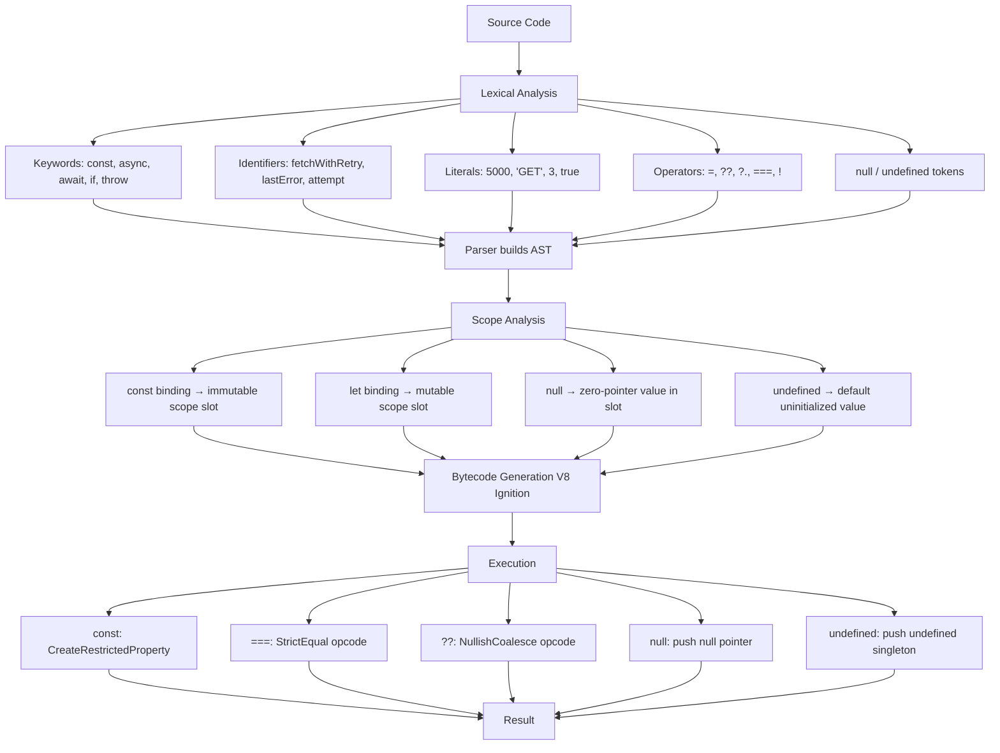

# JavaScript Fundamentals: Keywords · Identifiers · Constants · Literals · Operators · null vs undefined

## 1. Executive Summary

This document covers six foundational JavaScript concepts that form the vocabulary and grammar of the language.

**Keywords** — Reserved words with special syntactic meaning (`if`, `for`, `let`, `class`, `return`, `import`, etc.). They are the fixed vocabulary of the language. You cannot use them as variable names.

**Identifiers** — Names you create for variables, functions, classes, properties, and modules. Rules: must start with a letter, `_`, or `$`; can contain those plus digits; case-sensitive; Unicode-supported; cannot be reserved keywords.

**Constants** — Immutable bindings created with the `const` keyword. The identifier cannot be reassigned after initialization. The value itself (especially objects/arrays) can still be mutated.

**Literals** — Fixed values written directly in source code: string literals (`"hello"`), number literals (`42`), boolean literals (`true`, `false`), null literal (`null`), array literals (`[1,2,3]`), object literals (`{a:1}`), template literals (`` `${x}` ``).

**Operators** — Symbols that perform operations on values: arithmetic (`+`, `-`, `*`, `/`), comparison (`===`, `>`, `<`), logical (`&&`, `||`, `!`), assignment (`=`, `+=`), bitwise (`&`, `|`, `~`), ternary (`? :`), spread (`...`), optional chaining (`?.`), nullish coalescing (`??`).

**null vs undefined** — Two distinct primitive values meaning "nothing" or "absence." `undefined` is the default value assigned by JavaScript when a variable is declared but not initialized, a function returns nothing, or a property doesn't exist. `null` is an intentional assignment meaning "no value." They are loosely equal (`null == undefined` → true) but strictly different (`null === undefined` → false).

---

## 2. First Principles

### How These Concepts Fit Together

Think of JavaScript as a language with **words** and **grammar**:

```
Source Code:      const   userName    =   "Alice"        ;
                    │         │            │               │
                 Keyword  Identifier    Literal       Punctuator
                 (const)  (userName)  (String "Alice")  (semicolon)
```

Now add operators into the mix:

```
Source Code:      const   total    =    price    +    tax    ;
                    │        │           │        │     │     │
                 Keyword  Identifier   Identifier Op  Identifier
```

### The Core Relationship

- **Keywords** define the syntactic structure (what can be written and where)
- **Identifiers** name the data and functions we work with
- **Literals** are the actual data values written in the code
- **Operators** transform and compare those values
- **Constants** are a specific kind of identifier (declared with `const`)
- **null/undefined** are specific values (one a literal, one a default state)

### Execution Flow

When the JavaScript engine processes `const user = getUserName(name) ?? 'Guest';`:

1. **Lexing:** Scanner identifies tokens → `KEYWORD_CONST`, `IDENTIFIER(user)`, `PUNCTUATOR(=)`, `IDENTIFIER(getUserName)`, `PUNCTUATOR(()`, `IDENTIFIER(name)`, `PUNCTUATOR())`, `OPERATOR(??)`, `LITERAL('Guest')`, `PUNCTUATOR(;)`
2. **Parsing:** Parser builds AST confirming the `const` keyword means a VariableDeclaration, the `??` means a LogicalExpression
3. **Scope analysis:** `user` is registered as a const binding (immutable, TDZ)
4. **Bytecode generation:** `const` → CreateRestrictedProperty, `??` → NullishCoalesce bytecode
5. **Execution:** The function call runs, `??` checks for null/undefined, assigns `'Guest'` if needed

---

## 3. Real World Analogy

**Analogy: A Library System**

| JavaScript Concept | Library Analogy |
|---|---|
| **Keywords** | Library rules: "You must check out books at the front desk" (fixed, unchangeable rules) |
| **Identifiers** | Book titles and catalog numbers — names we assign to identify things |
| **Constants** | The building's address — permanently assigned, cannot be moved |
| **Literals** | Actual books on the shelf — the real physical objects, not references |
| **Operators** | Actions: combine books (`+`), compare books (`===`), check if a book exists (`typeof`) |
| **null** | An empty bookshelf that was intentionally left empty (purposefully no value) |
| **undefined** | A shelf space that was never built (never assigned a value) |

---

## 4. Comparison Tables

### 4a. Keywords vs Identifiers

| Feature | Keywords | Identifiers |
|---|---|---|
| Definition | Reserved words in the language grammar | User-chosen names for entities |
| Who defines them | ECMAScript specification | The developer |
| Count | ~44 (ES2023) plus ~8 future reserved | Unlimited |
| Can be used as variable name? | No (most) | Yes |
| Case-sensitive? | Yes — `If` ≠ `if` | Yes |
| Can be property name? | Yes — `obj.class` is valid | N/A |
| Examples | `if`, `for`, `let`, `class`, `return` | `userName`, `totalPrice`, `getData` |

### 4b. Constants vs Variables

| Feature | Constants (`const`) | Variables (`let`) | Variables (`var`) |
|---|---|---|---|
| Reassignment | Not allowed | Allowed | Allowed |
| Scope | Block | Block | Function |
| Hoisting | Hoisted, TDZ | Hoisted, TDZ | Hoisted, initialized `undefined` |
| Redeclaration | SyntaxError | SyntaxError | Allowed (ignored) |
| Global object property | No | No | Yes (`window.varName`) |
| Must initialize? | Yes | No | No |

### 4c. Literals vs Identifiers

| Feature | Literals | Identifiers |
|---|---|---|
| What they are | Fixed values in source code | Names referencing values |
| Can change? | Never — a literal is always that exact value | The referenced value can change |
| Memory | Becomes an immutable value in memory at parse time | Points to a value in memory |
| Examples | `42`, `"hello"`, `true`, `[1,2]`, `{a:1}` | `age`, `name`, `data`, `process` |

### 4d. null vs undefined

| Feature | `null` | `undefined` |
|---|---|---|
| Type | `object` (typeof bug) | `undefined` |
| Meaning | Intentional absence of value | Default absence / uninitialized |
| Who assigns it | The developer (intentionally) | JavaScript engine (automatically) |
| Is it a literal? | Yes — `null` is a literal | Not exactly — `undefined` is a global variable |
| Can be reassigned? | N/A (it's a literal) | Not in modern code (immutable global in ES5+) |
| `JSON.stringify` | `"null"` (included) | `undefined` (omitted from JSON) |
| `==` comparison | `null == undefined` → true | `undefined == null` → true |
| `===` comparison | `null === undefined` → false | `undefined === null` → false |
| Default parameters | Does NOT trigger default | DOES trigger default (`function(x = 5) {}`) |
| Property existence | Property exists with null value | Property doesn't exist |

### 4e. Operator Types

| Category | Operators | Purpose |
|---|---|---|
| Arithmetic | `+`, `-`, `*`, `/`, `%`, `**` | Mathematical calculations |
| Assignment | `=`, `+=`, `-=`, `*=`, `/=` | Assign values to variables |
| Comparison | `===`, `!==`, `>`, `<`, `>=`, `<=` | Compare values (strict) |
| Loose Comparison | `==`, `!=` | Compare with type coercion |
| Logical | `&&`, `||`, `!` | Boolean logic |
| Bitwise | `&`, `|`, `^`, `~`, `<<`, `>>`, `>>>` | Binary-level operations |
| Unary | `typeof`, `void`, `delete`, `+`, `-`, `!`, `~` | Single operand operations |
| Ternary | `? :` | Conditional expression |
| Nullish Coalescing | `??` | Fallback on null/undefined only |
| Optional Chaining | `?.` | Safe property access |
| Spread | `...` | Expand iterables |
| Comma | `,` | Evaluate multiple expressions |
| `in` | `prop in obj` | Check property existence |
| `instanceof` | `obj instanceof Class` | Check prototype chain |

---

## 5. Problem Statement

### Before These Concepts

Early programming languages (assembly, early BASIC, FORTRAN) had minimal abstraction layers. Variables were memory addresses. Values were binary. There was no distinction between "this name refers to a memory location" (identifier) vs "this is a special instruction" (keyword).

### Why Previous Approaches Failed

- **Assembly** — everyone used raw memory addresses and jump instructions. A single typo crashed the entire system. No distinction between keywords and identifiers because everything was an instruction or an address.
- **Early BASIC** — had `LET` as optional for assignment. Variables were dynamically typed. No `const`. No clear distinction between literals and identifiers. `null` didn't exist — many languages used `-1` or `0` as sentinel values, causing bugs.

### Why This Solution Became Popular

JavaScript (and C, Java, Python, etc.) adopted clear separation of concerns:
- **Keywords** → the grammar rules are fixed and validated at parse time
- **Identifiers** → the developer has full naming freedom within clear constraints
- **Literals** → values are immediately obvious from the source code (`42` is the number 42)
- **Operators** → operations are concise and composable
- **Constants** → `const` prevents accidental reassignment and signals intent
- **null/undefined** → two distinct "nothing" values for two distinct scenarios (intentional vs automatic)

---

## 6. Internal Working

### How the Engine Distinguishes These Concepts

#### Phase 1: Lexical Analysis (The Scanner)

The scanner reads characters and decides what kind of token each sequence is:

```javascript
// Input: const PI = 3.14159;
//
// Character by character:
// 'c' → start reading, gather 'o','n','s','t' → "const"
// Is "const" in the keyword table? YES → emit KEYWORD_CONST
//
// ' ' → whitespace, skip
// 'P','I' → "PI"
// Is "PI" in the keyword table? NO → emit IDENTIFIER "PI"
//
// ' ' → whitespace
// '=' → is it an operator? YES → emit OPERATOR_ASSIGN
//
// ' ' → whitespace
// '3','.', '1','4','1','5','9' → "3.14159"
// Is it a number literal? YES → emit NUMBER_LITERAL "3.14159"
//
// ';' → emit PUNCTUATOR_SEMICOLON
// EOF → end
```

#### Phase 2: Parsing

The parser checks the token stream against the grammar. For `const PI = 3.14159`:
- `KEYWORD_CONST` → expects a VariableDeclaration
- `IDENTIFIER "PI"` → the name being declared
- `OPERATOR_ASSIGN` → expects an initializer (required for const)
- `NUMBER_LITERAL` → the initial value
- AST node: `{ type: "VariableDeclaration", kind: "const", declarations: [{ type: "VariableDeclarator", id: { type: "Identifier", name: "PI" }, init: { type: "Literal", value: 3.14159 } }] }`

#### Phase 3: Bytecode Generation

V8 Ignition generates bytecode:
```
CreateRestrictedProperty PI, const     ← const creates immutable binding
LdaSmi [3.14159]                       ← Load Small Integer (literal)
InitConst PI                           ← Initialize the constant binding
```

The keyword `const` causes the engine to generate `CreateRestrictedProperty` instead of `CreateMutableBinding` (for `let`).

#### Phase 4: Execution

- `const PI` → Binding created in the lexical environment. Marked as immutable.
- `= 3.14159` → Value assigned to the binding.
- Any later attempt to write to `PI` → Runtime `TypeError: Assignment to constant variable`.

### null vs undefined at the Engine Level

**undefined:**
- When a variable is declared with `let x;` (no initializer), the engine sets the binding's value to the singleton `undefined` value
- When a function has no `return`, the engine pushes `undefined` as the return value
- When a property doesn't exist (`obj.nonexistent`), the engine returns `undefined`
- `undefined` is a global property on the global object — it's a value, not a keyword

**null:**
- `null` is a literal that evaluates to the singleton `null` value
- The engine stores `null` as a special pointer (zero address) internally
- `typeof null === "object"` — this is a historical bug from 1996. The original JavaScript engine used type tags where the low bits indicated type. `null` was represented as the null pointer (0x00), which had type tag 0 — the same as the "object" type tag.

```
Internal representation:
null       → 0x00 (null pointer, type tag = 0 = "object") — BUG
undefined  → Special singleton value, type tag = "undefined"
```

---

## 7. Architecture Breakdown

These concepts operate at different layers of the language:

```
┌──────────────────────────────────────────────────────────┐
│                    SOURCE CODE LAYER                      │
│  You write:                                              │
│  const user = { name: "Alice", age: null };              │
│  let data;  // undefined                                 │
│  typeof user === "object"                                │
└──────────────────────┬───────────────────────────────────┘
                       │
                       ▼
┌──────────────────────────────────────────────────────────┐
│                LEXICAL ANALYSIS LAYER                     │
│  const     → KEYWORD_CONST                               │
│  user      → IDENTIFIER                                  │
│  =         → OPERATOR_ASSIGN                             │
│  {         → PUNCTUATOR_LBRACE                           │
│  "Alice"   → LITERAL_STRING                              │
│  null      → LITERAL_NULL (or KEYWORD_NULL)              │
│  typeof    → KEYWORD_TYPEOF (or OPERATOR)                │
│  ===       → OPERATOR_STRICT_EQUAL                       │
└──────────────────────┬───────────────────────────────────┘
                       │
                       ▼
┌──────────────────────────────────────────────────────────┐
│                 SYNTAX ANALYSIS LAYER                     │
│  VariableDeclaration (kind: const)                       │
│    → ObjectExpression                                    │
│      → Property: "name" → StringLiteral "Alice"          │
│      → Property: "age" → NullLiteral                     │
│  BinaryExpression (===)                                   │
│    → UnaryExpression (typeof)                            │
│    → StringLiteral "object"                              │
└──────────────────────┬───────────────────────────────────┘
                       │
                       ▼
┌──────────────────────────────────────────────────────────┐
│                 RUNTIME LAYER                             │
│  const user = { name: "Alice", age: null };             │
│  │ Creates object on heap                                │
│  │ Binds 'user' identifier → immutable reference        │
│  │ 'null' → zero pointer in age slot                    │
│  │                                                       │
│  let data;   → binding exists, value = undefined        │
│                                                           │
│  typeof user === "object"                                │
│  │ typeof → returns "object" string                      │
│  │ === → strict equality check, no coercion              │
│  │ Result: true                                          │
└──────────────────────────────────────────────────────────┘
```

---

## 8. End-to-End Walkthrough

Let's trace this code which uses all six concepts:

```javascript
const MAX_RETRIES = 3;
let attempt = 0;
let result = null;

while (attempt < MAX_RETRIES) {
  attempt++;
  const response = fetchData(attempt);

  if (response === null) {
    continue;
  }

  result = response;
  break;
}

console.log(result ?? "All retries failed");
```

**Step 1 — Lexing:**
- `const` → KEYWORD_CONST
- `MAX_RETRIES` → IDENTIFIER
- `=` → OPERATOR_ASSIGN
- `3` → LITERAL_NUMBER
- `;` → PUNCTUATOR
- `let` → KEYWORD_LET
- `attempt` → IDENTIFIER
- `= 0` → OPERATOR_ASSIGN + LITERAL_NUMBER
- `let result = null` → KEYWORD_LET + IDENTIFIER + OPERATOR_ASSIGN + LITERAL_NULL
- `while` → KEYWORD_WHILE
- `(` → PUNCTUATOR_LPAREN
- `attempt` → IDENTIFIER
- `<` → OPERATOR_LESS_THAN
- `MAX_RETRIES` → IDENTIFIER
- ... and so on

**Step 2 — Parsing:** AST built with:
- VariableDeclaration (const)
- VariableDeclaration (let) × 2
- WhileStatement
- Block containing:
  - UpdateExpression (attempt++)
  - VariableDeclaration (const response)
  - IfStatement
  - ContinueStatement
  - AssignmentExpression (result = response)
  - BreakStatement
- ExpressionStatement (console.log)
- BinaryExpression (??)

**Step 3 — Scope Analysis:**
- `MAX_RETRIES` → block-scoped (const), TDZ, immutable
- `attempt` → block-scoped (let), TDZ, mutable
- `result` → block-scoped (let), initially `null`
- `response` → block-scoped to while body (const), new binding per iteration

**Step 4 — Execution:**
1. `const MAX_RETRIES = 3` → Binding created, immutable, TDZ ends
2. `let attempt = 0` → Binding created, mutable, initialized to 0
3. `let result = null` → Binding created, mutable, intentionally initialized to `null`
4. `while (attempt < MAX_RETRIES)` → Compare 0 < 3 → true
5. `attempt++` → Increment to 1
6. `const response = fetchData(1)` → Calls function, assigns result
7. `if (response === null)` → Strict comparison, check if null
8. If null → `continue` → back to while condition
9. If not null → `result = response`, `break` → exit loop
10. `console.log(result ?? "All retries failed")` → `??` checks: is result null or undefined? If yes → use fallback string

---

## 9. Code Walkthrough

### Production Example: API Client with Full Concepts

### apiClient.js

```javascript
// KEYWORDS:      const    import    from      export    default    async    await
// IDENTIFIERS:   API_TIMEOUT, fetchWithRetry, url, options, attempt, maxRetries
// CONSTANTS:     API_TIMEOUT, DEFAULT_HEADERS, RETRY_DELAYS
// LITERALS:      5000, "application/json", 1000, 2000, 4000, "GET", 3
// OPERATORS:     =, +=, ??, ?, :, &&, ===, !, ..., >
// null/undefined: null (intentional), undefined (if property missing)

const API_TIMEOUT = 5000;

const DEFAULT_HEADERS = {
  "Content-Type": "application/json",
  Accept: "application/json",
};

const RETRY_DELAYS = [1000, 2000, 4000];

export async function fetchWithRetry(url, options = {}) {
  // Operator: = for default parameter
  // undefined triggers default, null does not
  const { method = "GET", headers = {}, maxRetries = 3 } = options;

  let attempt = 0;
  let lastError = null;       // Intentional null — we'll check this later

  while (attempt < maxRetries) {
    attempt++;

    try {
      const controller = new AbortController();
      const timeoutId = setTimeout(() => controller.abort(), API_TIMEOUT);

      const response = await fetch(url, {
        method,
        headers: { ...DEFAULT_HEADERS, ...headers },
        signal: controller.signal,
      });

      clearTimeout(timeoutId);

      // Operator: ! (NOT), response.ok is boolean
      if (!response.ok) {
        const errorBody = await response.text();

        // Operator: ?? — use fallback only if null or undefined
        const errorMessage = errorBody ?? "Unknown error";

        throw new Error(
          `HTTP ${response.status}: ${errorMessage}`
        );
      }

      return await response.json();
    } catch (error) {
      lastError = error;

      // Operator: !== (strict not equal)
      // Operator: && (logical AND)
      // Operator: < (less than)
      // Operator: ? + : (ternary)
      const delay =
        attempt < maxRetries && error.name !== "AbortError"
          ? RETRY_DELAYS[attempt - 1] ?? 1000
          : 0;

      if (delay > 0) {
        console.warn(`Retry ${attempt}/${maxRetries} after ${delay}ms`);
        await new Promise((resolve) => setTimeout(resolve, delay));
      }
    }
  }

  // null vs undefined: lastError was explicitly set to null,
  // then assigned the error object if catch ran.
  // If no error ever occurred (impossible here, but pattern shown):
  if (lastError === null) {
    throw new Error("Unexpected state: no error but no result");
  }

  throw lastError;
}
```

### userService.js

```javascript
import { fetchWithRetry } from "./apiClient.js";

const BASE_URL = "https://api.example.com/v2";

export async function getUser(id) {
  const data = await fetchWithRetry(`${BASE_URL}/users/${id}`, {
    method: "GET",
    headers: { Authorization: `Bearer ${getToken()}` },
    maxRetries: 2,
  });

  // ?? operator: data could be null from API
  const user = data ?? null;

  // Operator: && and ?. for safe access
  if (user?.isActive && user?.email) {
    return user;
  }

  return null;
}
```

### configValidator.js

```javascript
export function validateConfig(config) {
  const errors = [];

  // Operator: typeof (type check), === (strict equality)
  if (typeof config.apiUrl !== "string") {
    errors.push("apiUrl must be a string");
  }

  // null vs undefined: check both
  if (config.timeout == null) {   // == catches both null AND undefined
    errors.push("timeout is required");
  }

  // Operator: ! (NOT)
  if (!Array.isConfig(config.retryDelays)) {
    errors.push("retryDelays must be an array");
  }

  // Operator: ?? for default
  const port = config.port ?? 8080;

  return {
    isValid: errors.length === 0,
    errors,
    port,
  };
}
```

### Key Points from This Code

| Concept | Example | Explanation |
|---|---|---|
| Keyword | `const`, `async`, `await`, `if`, `throw` | These structure the code — they're the grammar |
| Identifier | `fetchWithRetry`, `lastError`, `attempt` | Names we chose for our entities |
| Constant | `API_TIMEOUT = 5000` | Immutable binding — will never be reassigned |
| Literal | `5000`, `"application/json"`, `3`, `true` | Fixed values written directly in code |
| Operator | `=`, `??`, `?.`, `!`, `===`, `...`, `>` | Symbols performing operations |
| null | `let lastError = null` | Intentional "no value" assignment |
| undefined | `options = {}` default param | Triggered when caller omits argument |

---

## 10. Request Pipeline — Mermaid Diagram



---

## 11. Data Flow

### How null vs undefined Travel Through the System

```javascript
// 1. API response
const apiData = await fetch("/api/user");  // Could be { name: "Alice" } or null

// 2. null propagates as intentional absence
const user = apiData;  // Could be null — the API intentionally returned nothing

// 3. Optional chaining stops at null/undefined
const userName = user?.name;  // undefined if user is null/undefined, "Alice" otherwise

// 4. Nullish coalescing provides fallback
const displayName = userName ?? "Guest";  // "Guest" only if userName is null/undefined

// 5. undefined from missing property
const missing = user?.nonexistent;  // undefined — property doesn't exist

// 6. Default parameters (only triggered by undefined)
function greet(name = "Guest") {
  return `Hello, ${name}`;
}

greet("Alice");   // "Hello, Alice"
greet(undefined);  // "Hello, Guest"  ← default triggered
greet(null);       // "Hello, null"   ← default NOT triggered!
```

### The null/undefined Propagation Chain

```
API returns null
  → const data = response.json()    // data = null
    → user.name                      // TypeError: Cannot read properties of null
      → user?.name                   // undefined (safe)
        → userName ?? "Guest"        // "Guest"
```

```
Property doesn't exist
  → obj.missing                      // undefined
    → JSON.stringify(obj)            // property omitted from JSON
      → ?? "fallback"                // "fallback"
```

---

## 12. Production Best Practices

### Coding Practices — All Six Concepts

**Keywords:**
- Always use `const` by default, `let` when reassignment is needed, never `var` in new code
- Always use `===` and `!==` over `==` and `!=` (exception: `== null` is acceptable for checking both null/undefined)
- Always use `async/await` over `.then()`
- Always use `import/export` over `require()` in modern Node.js

**Identifiers:**
- Use descriptive, intention-revealing names: `userEmail` not `ue` or `x`
- camelCase for variables/functions, PascalCase for classes, UPPER_SNAKE_CASE for constants
- Boolean identifiers should be questions: `isActive`, `hasPermission`, `canEdit`
- Avoid single-letter identifiers except loop counters (`i`, `j`, `k`)

**Constants:**
- Use for everything that shouldn't be reassigned
- Module-level constants in UPPER_SNAKE_CASE
- Function-level constants in camelCase

**Literals:**
- Prefer array/object literals over `new Array()` / `new Object()`
- Use template literals over string concatenation
- Use numeric separators for large numbers: `1_000_000` instead of `1000000`

**Operators:**
- Use `??` instead of `||` for defaults (unless you want to catch empty string, 0, false)
- Use `?.` for safe property access instead of `&&` chaining
- Use `===` / `!==` always
- Never use `++` / `--` in larger expressions — use standalone statements

**null vs undefined:**
- Use `null` for intentional "no value" — it's explicit and signals intent
- Let `undefined` be the default — don't assign it manually
- Use `??` for nullish fallbacks
- Use `== null` to check for BOTH null and undefined (this is the one acceptable use of `==`)
- Never check `if (x)` when you mean `if (x !== null && x !== undefined)` — falsy values like `0`, `''`, `false` will be missed

### Security
- Never use `eval()` — it parses arbitrary strings as code, bypassing all keyword/identifier rules
- Use `??` over `||` for safe defaults when `0` or `""` are valid values
- Avoid `delete` on objects in performance-critical paths (deoptimizes V8 hidden classes)

### Performance
| Operation | Cost | Notes |
|---|---|---|
| `===` | ~1 CPU instruction | Fastest comparison |
| `??` | ~2-3 ops | Nullish check + fallback |
| `?.` | ~2-3 ops | Short-circuit if null/undefined |
| `typeof` | ~1 op | Returns string |
| `const` | Same as `let` | Both optimize to same bytecode |
| spread `...` | O(n) where n = properties | Use `Object.assign()` for performance |

### Logging
```javascript
// Always log both the type and the value when debugging null/undefined
logger.debug("User data received", { user: data ?? null });
logger.warn("Retry attempt", { attempt, maxRetries, error: lastError?.message });
```

---

## 13. Common Production Mistakes

### Mistake 1: `||` instead of `??` for defaults
```javascript
// Junior
const count = user.input || 10;   // BUG: if user.input = 0, count becomes 10!

// Senior
const count = user.input ?? 10;   // 0 stays 0, null/undefined becomes 10
```

### Mistake 2: Not checking for null/undefined before access
```javascript
// Junior
const name = user.name;  // TypeError if user is null

// Senior
const name = user?.name ?? "Unknown";
```

### Mistake 3: Using `==` instead of `===`
```javascript
// Junior
if (value == 42) { }  // true for "42", [42], etc.

// Senior
if (value === 42) { }  // Only true for number 42
```

### Mistake 4: Assigning `undefined` manually
```javascript
// Junior — unnecessary
let data = undefined;
let config = undefined;

// Senior — use null for intentional absence
let data = null;  // "I intend this to be empty"
let config;       // "I'll assign this later" (undefined is automatic)
```

### Mistake 5: Confusing `null` with falsy values
```javascript
// Junior
if (!value) {
  // Runs for null, undefined, 0, '', false, NaN
  value = "default";
}
// BUG: If value = 0 is valid, it gets overwritten!

// Senior
if (value == null) {  // Only null or undefined
  value = "default";
}
```

### Mistake 6: Using `var` instead of `const`/`let`
```javascript
// Junior — function-scoped, hoisted, pollutes window
for (var i = 0; i < 3; i++) {
  setTimeout(() => console.log(i), 100);  // 3, 3, 3
}

// Senior
for (let i = 0; i < 3; i++) {
  setTimeout(() => console.log(i), 100);  // 0, 1, 2
}
```

### Mistake 7: Trying to reassign a `const`
```javascript
// Junior
const config = loadConfig();
config = loadNewConfig();  // TypeError

// Senior
let config = loadConfig();
config = loadNewConfig();  // OK
```

### Mistake 8: Using `new Object()` / `new Array()` instead of literals
```javascript
// Junior
const obj = new Object();
obj.name = "Alice";
const arr = new Array(1, 2, 3);

// Senior
const obj = { name: "Alice" };
const arr = [1, 2, 3];
```

---

## 14. Debugging Guide

### Common Errors

**TypeError: Assignment to constant variable**
```
Cause: You tried to reassign a `const` identifier
Fix: Change to `let` if reassignment is needed
```

**TypeError: Cannot read properties of null**
```
Cause: You accessed a property on `null`
Fix: Use optional chaining `?.` or check for null first
```

**TypeError: Cannot read properties of undefined**
```
Cause: You accessed a property on `undefined`
Fix: Check if the value exists, use `?.` or default with `??`
```

**ReferenceError: x is not defined**
```
Cause: The identifier doesn't exist in any reachable scope
Fix: Declare it, import it, or fix the spelling
```

**SyntaxError: Unexpected token**
```
Cause: You used a keyword as an identifier, or invalid literal syntax
Fix: Rename the identifier, fix the literal
```

### Debugging Checklist
1. Is the identifier spelled correctly?
2. Is the identifier in scope (function, block, module boundaries)?
3. Is it a `const` being reassigned? → Use `let`
4. Is it `null` or `undefined` when you expected a value? → Check with `console.log`
5. Is `||` swallowing valid falsy values (0, '', false)? → Use `??`
6. Is `==` causing type coercion? → Use `===`
7. Is `typeof` returning an unexpected string? → Check `typeof null === "object"`
8. Is the literal formatted correctly? → Check quotes, template syntax, numeric format

### Chrome DevTools Debugging
1. Add `debugger;` or set a breakpoint
2. Hover over any identifier to see its current value
3. The Scope panel shows all identifiers with their values (and whether they're const/let/var)
4. Watch panel: right-click → "Add to watch" to track specific identifiers
5. Console: type the identifier name to inspect its current value

---

## 15. Performance Considerations

| Operation | Relative Cost | Notes |
|---|---|---|
| Identifier resolution | O(1) — negligible | V8 optimizes to scope slot indices |
| `const` vs `let` | No difference | Both compile to same bytecode |
| `===` | ~1 CPU cycle | Fastest operation |
| `??` | ~2 CPU cycles | Null check + fallback |
| `?.` | ~2 CPU cycles | Property access + null check |
| `typeof` | ~1 CPU cycle | Returns string from internal type tag |
| Object literal `{}` | ~O(1) allocation | V8 optimizes with object literals |
| Array literal `[]` | ~O(1) allocation | Fast path in V8 |
| Spread `...obj` | O(n) | Copies all own properties |
| `null` comparison | ~1 CPU cycle | Zero pointer comparison |
| `undefined` comparison | ~1 CPU cycle | Singleton comparison |
| `==` vs `===` | `==` is slower | `==` must call ToPrimitive coercion |

### Key Performance Insight
The JavaScript engine doesn't care about these concepts at runtime after compilation:
- Keywords → compiled away into bytecode instructions
- Identifiers → replaced with scope slot indices after parsing
- Literals → stored in the constant pool, referenced by index
- Operators → compiled into specific bytecode opcodes
- null/undefined → runtime values, fast singleton comparisons

---

## 16. System Design Perspective

### Microservices
- **`const`** for configuration values, service endpoints, and immutable shared state
- **`??`** for providing fallback defaults in distributed calls
- **`?.`** for safe access to potentially null API responses
- **`typeof`** and **`instanceof`** for validating data types at service boundaries
- **null vs undefined** — define a clear convention for your API contracts. Standard: `null` means "intentionally empty", omit the field for "not applicable"

### API Contracts
```javascript
// Standard API response types using null vs undefined
const API_RESPONSE_TYPES = {
  // null: "This user has no name set" (intentional)
  SUCCESS: { user: { id: 1, name: null } },
  // undefined: never set, don't serialize
  PARTIAL: { user: { id: 1 } },  // name not included
};
```

### Distributed Systems
- **Optional chaining (`?.`)** is critical for resilient distributed code — any external call can return null/undefined
- **Nullish coalescing (`??`)** for safe fallback when cache misses or services return empty responses
- **Constants** for retry delays, timeouts, circuit breaker thresholds — change in one place

### Cloud/Serverless
```javascript
// Lambda handler — uses const for immutable bindings
export const handler = async (event) => {
  const batchSize = parseInt(process.env.BATCH_SIZE ?? "10", 10);
  const records = event.Records ?? [];

  for (const record of records ?? []) {
    await processRecord(record);
  }
};
```

---

## 17. Testing Perspective

### Unit Testing null vs undefined
```javascript
describe("null vs undefined behavior", () => {
  it("?? only catches null and undefined", () => {
    const defaultValue = "default";

    expect(null ?? defaultValue).toBe("default");
    expect(undefined ?? defaultValue).toBe("default");
    expect(0 ?? defaultValue).toBe(0);        // 0 is not nullish
    expect("" ?? defaultValue).toBe("");       // "" is not nullish
    expect(false ?? defaultValue).toBe(false);  // false is not nullish
  });

  it("|| catches all falsy values", () => {
    const defaultValue = "default";

    expect(null || defaultValue).toBe("default");
    expect(undefined || defaultValue).toBe("default");
    expect(0 || defaultValue).toBe("default");      // 0 is falsy
    expect("" || defaultValue).toBe("default");      // "" is falsy
    expect(false || defaultValue).toBe("default");   // false is falsy
  });

  it("?. stops at null/undefined", () => {
    const obj = { a: { b: 42 } };

    expect(obj?.a?.b).toBe(42);
    expect(obj?.x?.y).toBe(undefined);
    expect(null?.a).toBe(undefined);
    expect(undefined?.a).toBe(undefined);
  });
});
```

### Testing Constants and Identifiers
```javascript
describe("constants are immutable bindings", () => {
  it("cannot reassign const", () => {
    expect(() => {
      "use strict";   // Actually tested at SyntaxError level
      // This would throw at parse time, not runtime
    }).toThrow(SyntaxError);  // const reassignment is caught at parse time
  });

  it("const objects can still mutate", () => {
    const config = { port: 3000 };
    config.port = 4000;     // OK — mutating the object
    expect(config.port).toBe(4000);

    // But cannot reassign config itself
    expect(() => {
      config = { port: 5000 };
    }).toThrow(TypeError);
  });
});
```

### Testing Operators
```javascript
describe("operator behavior", () => {
  it("=== does not coerce types", () => {
    expect(42 === "42").toBe(false);
    expect(null === undefined).toBe(false);
    expect(true === 1).toBe(false);
  });

  it("typeof returns expected strings", () => {
    expect(typeof 42).toBe("number");
    expect(typeof "hello").toBe("string");
    expect(typeof true).toBe("boolean");
    expect(typeof undefined).toBe("undefined");
    expect(typeof null).toBe("object");    // Historical bug!
    expect(typeof {}).toBe("object");
    expect(typeof Symbol()).toBe("symbol");
  });
});
```

---

## 18. Real Project Lifecycle

| Phase | Relevance |
|---|---|
| **Requirement Analysis** | Define domain vocabulary → these become identifiers. Define which values can be null vs undefined. |
| **Architecture Design** | Choose module system (import/export keywords). Define naming conventions (identifiers). Decide on null handling strategy (null object pattern vs null checks). |
| **Development** | Every line uses all six concepts. Most debated in code review: naming, operator choice (?? vs ||), null vs undefined usage. |
| **Code Review** | Top issues checked: `==` vs `===`, `||` vs `??`, meaningful identifiers, `const` vs `let`, `null` vs `undefined` assignment. |
| **Testing** | Test null/undefined paths, operator edge cases, identifier scope behavior. |
| **CI/CD** | ESLint enforces: `no-var`, `prefer-const`, `no-eval`, `eqeqeq` (===), `no-unsafe-optional-chaining`. |
| **Deployment** | Syntax errors involving keywords crash the entire application. Always lint. |
| **Production Support** | Most common bugs: null pointer exceptions, wrong operator (|| swallowing 0), const reassignment attempt. |

---

## 19. Real Industry Interview Questions

**Common Interview Question:** "What's the difference between `null` and `undefined` in JavaScript?"

**Common Interview Question:** "What's the difference between `==` and `===`?" (Amazon, Google)

**Common Interview Question (Meta):** "What does `typeof null` return and why?"

**Common Interview Question (Microsoft):** "Explain `let`, `const`, and `var` — how do they differ?"

**Common Interview Question (Netflix):** "What does the `??` operator do? How is it different from `||`?"

**Common Interview Question (Google):** "What characters can a JavaScript identifier start with?"

**Common Interview Question (Uber):** "What will this output and why?"
```javascript
console.log(null == undefined);   // ?
console.log(null === undefined);  // ?
console.log(typeof null);         // ?
console.log(typeof undefined);    // ?
```

**Common Interview Question:** "What is a literal in JavaScript? Give examples of each type."

**Common Interview Question (Salesforce):** "What's the temporal dead zone and which keywords are affected?"

**Common Interview Question (Amazon):** "When would you use `??` vs `||`? Show a real-world scenario where choosing the wrong one causes a bug."

---

## 20. Interview Questions by Experience

### 0–2 Years
- "What's the difference between `let`, `const`, and `var`?"
- "What characters can start a JavaScript identifier?"
- "What's the difference between `null` and `undefined`?"
- "What does `typeof` do? What's `typeof null`?"
- "What's the difference between `==` and `===`?"
- "What is a literal? Give 5 examples."

### 2–5 Years
- "Explain `??` (nullish coalescing) and how it differs from `||`."
- "What does the optional chaining operator `?.` do?"
- "Why is `typeof null === 'object'`?"
- "What is the temporal dead zone?"
- "Explain block scoping with `let` and `const`."
- "What happens when you access a property that doesn't exist on an object?"

### 5+ Years
- "How does V8 handle `const` at the bytecode level vs `let`?"
- "Explain the history of `typeof null === 'object'` — why can't it be fixed?"
- "What are contextual keywords in JavaScript? Give examples."
- "How does the `delete` operator affect V8's hidden classes?"
- "Design a scenario where using `||` instead of `??` causes a production bug."

### Senior Engineer
- "Your team has a codebase where `||` is used everywhere for defaults. How would you systematically migrate to `??`?"
- "How would you debug a production issue where a value is `null` but should have had a value?"
- "Explain how the JS engine distinguishes between keywords and identifiers during lexical analysis."
- "Design a utility function that safely deep-accesses nested properties without throwing on null."

### Staff Engineer / Architect
- "Design a config validation system that distinguishes between 'not set' (undefined), 'explicitly null' (null), and 'set to a value'."
- "You're designing an API contract format. Define the rules for when to use null vs omitting a field."

---

## 21. Detailed Interview Q&A

### Q: What's the difference between `null` and `undefined`?

**Why interviewer asks:** Tests understanding of JavaScript's two "nothing" values — a common source of bugs.

**Expected Answer:**
- **`undefined`**: Automatic default. A variable with no assigned value is `undefined`. A function with no `return` returns `undefined`. A missing property returns `undefined`. It's the engine's way of saying "nothing was set here."
- **`null`**: Intentional assignment. The developer explicitly sets a value to `null` to indicate "no value." It's the developer's way of saying "I deliberately set this to nothing."
- `null == undefined` is `true` (loose equality coerces them)
- `null === undefined` is `false` (strict equality checks type: they have different types)
- `typeof null` is `"object"` — historical bug
- `typeof undefined` is `"undefined"`
- Default function parameters only trigger for `undefined`, not `null`

**Common mistakes:**
- Saying "they're the same thing" — they're not
- Not knowing `typeof null === "object"` is a bug
- Claiming `undefined` is a keyword (it's a global property, not a keyword)

**Follow-up:** "What does `JSON.stringify({a: null, b: undefined})` return?"
Answer: `'{"a":null}'` — null is included, undefined properties are omitted.

**Senior Engineer answer:** At the engine level, `null` is typically represented as a zero pointer (0x00) — that's why `typeof` reads the low bits of the type tag and sees 0 (the "object" type tag). `undefined` is a separate singleton value in the engine. The spec says they're two distinct types (`Null` and `Undefined`), but `==` treats them as equal as a design choice for convenience.

### Q: Explain the `??` operator and how it differs from `||`.

**Why interviewer asks:** Tests knowledge of ES2020 operators and a common real-world bug.

**Expected Answer:**
- `??` (nullish coalescing) returns the right-hand operand ONLY if the left-hand is `null` or `undefined`
- `||` (logical OR) returns the right-hand operand if the left-hand is ANY falsy value (`null`, `undefined`, `0`, `""`, `false`, `NaN`)
- Use `??` when `0`, `""`, or `false` are valid values that should NOT trigger the default
- Use `||` only when you want to catch ALL falsy values (rare in modern code)
- `??` cannot be chained directly with `&&` or `||` without parentheses

```javascript
const count = 0;
count || 10   // 10 — BUG: 0 is valid but treated as falsy
count ?? 10   // 0 — correct: 0 is not nullish

const name = "";
name || "Guest"   // "Guest" — BUG: empty string is valid
name ?? "Guest"   // "" — correct: empty string is not nullish
```

**Common mistake:** Using `||` everywhere because "it works the same" — it doesn't when `0`, `''`, or `false` are valid values.

**Senior Engineer answer:** `??` is part of a trend in JavaScript toward more precise operators. Just as `===` replaced `==`, `??` replaces `||` for default values. In production codebases, I've seen real bugs where `||` swallowed valid `0` counts or empty strings. The migration pattern is: if the value should be replaced ONLY when absent (null/undefined), use `??`. If the value should be replaced when any falsy, use `||` — but this is rare.

---

## 22. Scenario-Based Interview Questions

### Scenario 1: `||` Swallowing Zero
**Question:** "A pricing system calculates a discount. When the discount is 0% (no discount), the system still applies a default 10% discount. The code uses `const discount = userDiscount || 0.1`. What's wrong?"

**Answer:** `||` treats `0` as falsy. When `userDiscount` is `0`, the expression evaluates to `0.1`. Fix: use `??` instead: `const discount = userDiscount ?? 0.1`. This preserves `0` as a valid discount value.

### Scenario 2: Null Pointer in Production
**Question:** "A production endpoint is throwing `TypeError: Cannot read properties of null (reading 'name')`. The developer says 'I checked the API, it always returns data.' Walk through debugging."

**Answer:**
1. Reproduce the error with the exact input that triggered it
2. Add `console.log('user data:', JSON.stringify(data))` before the crash
3. Check if `data` could be `null` — maybe the user was deleted, or the API returned 204 No Content
4. Fix with optional chaining: `data?.user?.name ?? "Unknown"`
5. Add a check: `if (data == null) { return handleNotFound(); }`
6. Never trust external data — always validate at service boundaries

### Scenario 3: Scope Shadowing Bug
**Question:** "A function returns `undefined` unexpectedly. The variable `count` exists in an outer scope, but the inner function doesn't see it. Why?"

**Answer:** The inner function declares its own `count` (with `let`, `const`, or as a parameter), shadowing the outer one. Example:
```javascript
const count = 5;
function process() {
  const count = 10;  // Shadows outer count
  console.log(count); // 10
}
```
Fix: Rename the inner variable or remove the duplicate declaration.

---

## 23. Rapid Fire

1. **Q:** Is `null` an object?
   **A:** No — `typeof null === "object"` is a historical bug. `null` is a primitive.

2. **Q:** Is `undefined` a keyword?
   **A:** No — it's a global property (but immutable in modern engines).

3. **Q:** Can you reassign a `const` variable?
   **A:** No — `TypeError: Assignment to constant variable`.

4. **Q:** Can you mutate a `const` object?
   **A:** Yes — `const` prevents reassignment, not mutation.

5. **Q:** What does `typeof undefined` return?
   **A:** `"undefined"`.

6. **Q:** What does `typeof null` return?
   **A:** `"object"` (historical bug).

7. **Q:** What's the result of `null == undefined`?
   **A:** `true` (loose equality).

8. **Q:** What's the result of `null === undefined`?
   **A:** `false` (strict equality — different types).

9. **Q:** Does `??` trigger on `0`?
   **A:** No — only `null` and `undefined`.

10. **Q:** Does `||` trigger on `0`?
    **A:** Yes — `0` is falsy.

11. **Q:** Can an identifier start with a number?
    **A:** No.

12. **Q:** Can an identifier contain a `$`?
    **A:** Yes — `$` is a valid identifier character.

13. **Q:** Is `class` a valid identifier?
    **A:** No — it's a reserved keyword.

14. **Q:** Is `obj.class` valid (property access)?
    **A:** Yes — reserved words can be property names.

15. **Q:** What's a string literal?
    **A:** A fixed string value in source code: `"hello"`, `'world'`, `` `template` ``.

16. **Q:** What's the difference between `=` and `===`?
    **A:** `=` is assignment, `===` is strict equality comparison.

17. **Q:** What does the `?.` operator do?
    **A:** Optional chaining — returns `undefined` if the left side is null/undefined, otherwise accesses the property.

18. **Q:** What does the `??` operator do?
    **A:** Nullish coalescing — returns the right side only if the left side is null or undefined.

19. **Q:** What happens when you access a non-existent property?
    **A:** Returns `undefined` (no error).

20. **Q:** What happens when you access a property on `null`?
    **A:** `TypeError: Cannot read properties of null`.

---

## 24. Interview Cheat Sheet

### 30-Second Explanation
"JavaScript has two 'nothing' values: `undefined` (automatic, assigned by the engine) and `null` (intentional, assigned by the developer). Use `===` not `==`. Use `??` for nullish defaults, not `||`. `const` prevents reassignment but not mutation. Identifiers start with a letter, `_`, or `$`. Keywords like `if` and `class` can't be identifiers but can be property names. Literals are fixed values in source code — `42`, `"hello"`, `true`, `[1,2]`, `{a:1}`."

### 2-Minute Explanation
"These six concepts form JavaScript's basic vocabulary:

1. **Keywords** — fixed by the spec. `if`, `for`, `let`, `const`, `class`, `return`, `import`, `async`, `await`, `try`, `catch`, `typeof`, `instanceof`, `delete`, `void`, `throw`, `new`, `this`, `super`, etc.

2. **Identifiers** — names you choose. Start with letter/`_`/`$`, then letters/digits/`_`/`$`. Case-sensitive. camelCase for variables/functions, PascalCase for classes, UPPER_SNAKE_CASE for constants.

3. **Constants** — declared with `const`. Immutable binding, block-scoped with TDZ. Can't reassign but can mutate.

4. **Literals** — fixed values in code: string literals (`"x"`), number literals (`42`), boolean (`true/false`), null (`null`), array (`[1,2]`), object (`{a:1}`), template (`` `${x}` ``), regex (`/pattern/`).

5. **Operators** — arithmetic (`+`, `-`, `*`, `/`, `%`, `**`), comparison (`===`, `!==`, `>`, `<`), logical (`&&`, `||`, `!`), nullish (`??`), optional chaining (`?.`), spread (`...`), ternary (`? :`), assignment (`=`, `+=`), `typeof`, `instanceof`, `in`, `delete`, `void`.

6. **null vs undefined** — `null` is intentional (developer sets it), `undefined` is automatic (engine sets it). `null == undefined` (`true`) but `null === undefined` (`false`). `typeof null` is `"object"` (bug).

### 5-Minute Explanation
"Let me walk through each concept in depth:

**Keywords** are part of the language grammar. The lexer recognizes them and produces keyword tokens, not identifier tokens. There are about 44 reserved keywords. Contextual keywords like `await` and `yield` only act as keywords in specific contexts. Reserved words can be property names: `obj.class` works fine.

**Identifiers** follow Unicode rules. They can include any Unicode letter (Greek, Cyrillic, CJK, etc.). `$` and `_` are treated as letters — `$` is commonly used in jQuery/Angular codebases, `_` for 'private' conventions.

**Constants** (`const`) have block scoping and a temporal dead zone. They're hoisted but not initialized — accessing before declaration throws ReferenceError. `const` does NOT make values immutable — only the binding is immutable. `const arr = [1]; arr.push(2)` is fine; `arr = [3]` is not.

**Literals** are the most efficient way to create values. An object literal `{}` is faster than `new Object()`. An array literal `[]` is faster than `new Array()`. Template literals provide string interpolation with `` `${var}` ``.

**Operators** have precedence rules. `*` binds tighter than `+`. `&&` binds tighter than `||` which binds tighter than `??`. The `??` operator cannot be directly chained with `&&` or `||` without parentheses — `a && b ?? c` is a SyntaxError; write `(a && b) ?? c`.

**null vs undefined** is a classic interview topic. Key facts: `null` is a literal keyword-like token; `undefined` is a global variable. `typeof null` returns `"object"` because in the original 1996 implementation, type tags were stored in the low bits, and null (0x00) shared the 0 tag with objects. This can never be fixed because fixing it would break existing code. In JSON, `null` is preserved, `undefined` is omitted. Default parameters use `undefined` to trigger defaults, not `null`."

### Whiteboard Explanation
```
KEYWORDS:  if, for, let, const, class, return, import, typeof, new, this...
           │ Cannot be used as variable names
           │ CAN be used as property names: obj.class

IDENTIFIERS:  [A-Za-z_$][A-Za-z0-9_$]* + Unicode
              Case-sensitive. Descriptive names preferred.

CONSTANTS:  const MAX = 100;    ← Immutable binding
            const obj = {};     ← Object CAN mutate
            const → Block scope, TDZ, MUST initialize

LITERALS:   42      ← Number literal
            "hi"    ← String literal
            true    ← Boolean literal
            null    ← Null literal
            [1,2]   ← Array literal
            {a:1}   ← Object literal
            `/x/`   ← Template literal

OPERATORS:
  Arithmetic:  +  -  *  /  %  **
  Comparison:  ===  !==  >  <  >=  <=
  Logical:     &&  ||  !
  Nullish:     ??  ?.
  Unary:       typeof  delete  void

null vs undefined:
  null            |   undefined
  Intentional     |   Automatic
  typeof="object" |   typeof="undefined"
  null==undefined → true
  null===undefined → false
```

### Senior Engineer Explanation
"The most interesting part of these concepts is how the JavaScript engine processes them under the hood.

**Keywords** are identified in the lexer using a trie or minimal perfect hash. The keyword set is baked into the engine's C++ source. When the parser sees `KEYWORD_CONST`, it knows to generate AST node `VariableDeclaration` with `kind: "const"`, which then generates bytecode `CreateRestrictedProperty` instead of `CreateMutableBinding`.

**`const` vs `let` at bytecode level:** In V8's Ignition interpreter, `const` creates a restricted property that the runtime checks for reassignment. `let` creates a mutable property. Both use the same scope slot mechanism. The difference is enforced at runtime — a store to a `const` binding triggers a `TypeError`. V8's TurboFan JIT can optimize `const` more aggressively because it knows the binding won't change.

**`typeof null === "object"`** — This is the canonical example of a bug that became a feature by accident. In the first version of JavaScript (1996), values were stored with type tags in the lower bits. Objects had type tag 0, integers had tag 1, etc. `null` was represented as the null pointer (0x00), which has type tag 0. So `typeof null` returned `"object"`. Brendan Eich has acknowledged it's a bug, but fixing it would break existing code. The TC39 committee has explicitly decided never to fix it.

**Operators like `??` and `?.`** are recent additions (ES2020) that address specific pain points. `??` was introduced because `||` was overused for defaults and caused bugs with valid falsy values. `?.` was introduced to replace verbose `&&` chains for safe property access. These operators are syntactic sugar that compiles to conditional checks in bytecode.

In production, the biggest advice I give about these concepts: be explicit about your intent. Use `const` to show 'this never changes'. Use `null` to show 'I intentionally set this to nothing'. Let `undefined` be the engine's default. Use `??` for defaults, `?.` for safe access, `===` for comparisons. Your code should communicate intent through these choices."

---

## 25. Common Misconceptions

### Misconception 1: "`undefined` and `null` are the same thing"
**Truth:** They're two different types (`Undefined` and `Null`). `undefined` is the engine's default absence; `null` is the developer's intentional absence. They're loosely equal (`==`) but strictly different (`===`).

### Misconception 2: "`typeof null === "object"` means null is an object"
**Truth:** `null` is a primitive. The `typeof` result is a bug from 1996 that can never be fixed.

### Misconception 3: "`const` means the value is immutable"
**Truth:** `const` means the **binding** is immutable (can't reassign). The **value** (objects/arrays) can still be mutated.

### Misconception 4: "`||` and `??` are interchangeable"
**Truth:** They behave differently for falsy values. `0 || 10` → `10`, but `0 ?? 10` → `0`. Use `??` unless you intentionally want to catch all falsy values.

### Misconception 5: "You can't use any keyword as a name"
**Truth:** You can't use keywords as **identifiers** (variable/function names), but you CAN use them as **property names**: `obj.class = 'first'` is valid.

### Misconception 6: "`undefined` is a keyword"
**Truth:** `undefined` is a global property, not a keyword. In non-strict mode (pre-ES5), it could be reassigned (never do this).

### Misconception 7: "`==` is just like `===` but looser"
**Truth:** `==` performs **type coercion** which can produce surprising results. `==` is not "just looser" — it follows complex coercion rules (ToPrimitive, ToNumber, etc.).

### Misconception 8: "Literals create objects through constructors"
**Truth:** Literals have a direct path in the engine. `{}` does NOT call `new Object()`. `[]` does NOT call `new Array()`. Literals are faster and handled specially by the engine.

### Misconception 9: "All operators evaluate left to right"
**Truth:** Operator precedence and associativity determine evaluation order. Assignment `=` is right-to-left. Ternary `? :` is right-to-left. `&&` and `||` short-circuit.

### Misconception 10: "Default parameters work with any falsy value"
**Truth:** Default parameters only trigger on `undefined`:
```javascript
function f(x = 5) { return x; }
f()         // 5 (undefined → default)
f(undefined) // 5 (explicit undefined → default)
f(null)     // null (null does NOT trigger default)
```

---

## 26. Related Concepts

| Concept | Why Learn It |
|---|---|
| **Type Coercion** | Why `==` behaves differently from `===`. The ToPrimitive/ToNumber/ToString algorithms. |
| **Falsy vs Nullish** | Which values are falsy vs nullish. Crucial for understanding `||` vs `??`. |
| **Scope & Hoisting** | How `const`/`let`/`var` identifiers behave in different scopes. TDZ. |
| **Expressions vs Statements** | Operators form expressions (produce values). Keywords often begin statements. |
| **Prototype Chain** | How `instanceof` operator works. How `delete` interacts with prototype properties. |
| **Object Property Descriptors** | `Object.defineProperty` — `writable`, `configurable` — the underlying mechanism of `const`. |
| **JSON Serialization** | How `null` and `undefined` are handled differently in `JSON.stringify`/`JSON.parse`. |
| **Short-Circuit Evaluation** | How `&&`, `||`, `??`, and `?.` stop evaluating early. |
| **Operator Precedence** | Full table of which operators bind tighter than others. |
| **Symbol.toPrimitive** | How objects are coerced by operators like `+`, `==`, `>`. |

---

## 27. TL;DR

1. **Keywords** (~44 reserved) are the grammar of the language — cannot be identifiers but can be property names
2. **Identifiers** must start with letter/`_`/`$`, contain those + digits, case-sensitive, Unicode-supported
3. **Constants** (`const`) = immutable binding, block-scoped, TDZ, value CAN still mutate
4. **Literals** = fixed values in source: `42`, `"hello"`, `true`, `null`, `[1,2]`, `{a:1}`, `` `${x}` ``
5. **Operators** perform operations: arithmetic, comparison, logical, assignment, nullish, optional chaining, spread, typeof, instanceof, delete
6. **null** = intentional absence (developer assigns it)
7. **undefined** = automatic absence (engine assigns it when nothing is set)
8. `null == undefined` → `true`, but `null === undefined` → `false`
9. `typeof null === "object"` — historical bug, won't be fixed
10. `??` is for nullish defaults (only null/undefined trigger it)
11. `||` is for falsy defaults (any falsy value triggers it — 0, '', false, null, undefined, NaN)
12. `?.` safely accesses properties, returns `undefined` on null/undefined
13. Default parameters only trigger on `undefined`, not `null`
14. `JSON.stringify` includes `null` but omits `undefined` properties
15. Always use `===` and `!==` — the only exception is `== null` to check both null/undefined

---

## 28. Key Takeaways

1. **These six concepts are the foundation of every line of JavaScript you write** — understanding them deeply prevents entire categories of bugs
2. **null vs undefined is the most common "nothing" confusion** — use null for intentional emptiness, let undefined be automatic
3. **`??` over `||` for defaults** — unless you explicitly want to replace `0`, `""`, or `false`
4. **`===` over `==`** — type coercion causes subtle, hard-to-find bugs
5. **`const` by default, `let` when needed, never `var`** — this is the universal production convention
6. **Descriptive identifiers are a sign of a senior engineer** — naming communicates intent to future readers
7. **Keywords structure the code** — they're not just arbitrary; every keyword has a specific grammatical role
8. **Literals are the most efficient value creation** — prefer `{}` over `new Object()`, `[]` over `new Array()`
9. **`?.` and `??` are your defense against null pointer exceptions** — use them at every external boundary
10. **The engine doesn't care about these distinctions after compilation** — keywords become opcodes, identifiers become slot indices, literals become constant pool entries. All of this is for human readability
