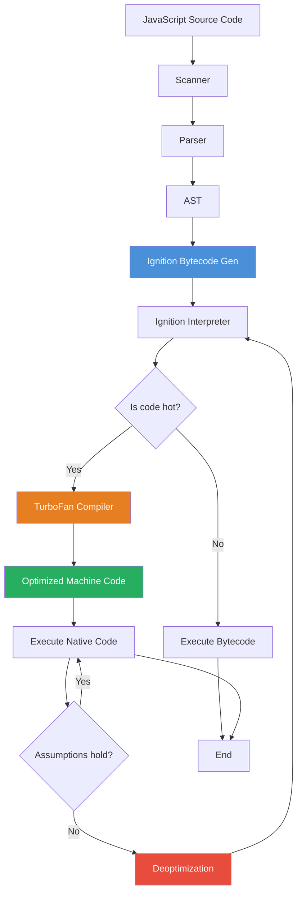

# V8 Engine

## 1. Executive Summary

| Question | Answer |
|---|---|
| **What is it?** | V8 is Google's open-source **JavaScript and WebAssembly engine**, written in C++. It powers Chrome, Node.js, Deno, Edge, and many other platforms. |
| **Why was it introduced?** | Early JavaScript engines were slow interpreters. V8 introduced **JIT (Just-In-Time) compilation** to make JS run at near-native speeds, enabling modern web apps and Node.js. |
| **What problem does it solve?** | JavaScript was too slow for complex apps (Gmail, Google Maps, etc.). V8 made JS fast enough for SPAs, server-side runtimes, and even databases. |
| **When should we use it?** | It's not something you "use" directly — it runs under the hood whenever you use Chrome, Node.js, Deno, Electron, or any V8-hosted runtime. |
| **When should we avoid it?** | If you need fine-grained control over memory/execution, consider lower-level runtimes (C/Rust). For ultra-lightweight embedded systems, consider alternatives like QuickJS or JerryScript. |

---

## 2. First Principles

To understand V8, start from the CPU:

- A **CPU** only understands **binary machine code** (0s and 1s).
- Humans write **JavaScript** — readable text.
- Something has to bridge this gap. That something is the **engine**.

V8 is that bridge. It takes your JavaScript, parses it, compiles it, and hands machine code to the CPU.

But here's the problem V8 had to solve: **JavaScript is dynamically typed, prototype-based, and highly dynamic**. You can change the shape of objects at runtime, add properties, delete methods — all while the program is running. This makes it hard to generate efficient machine code ahead of time (like C++ or Rust compilers do).

V8's solution: **Don't compile everything upfront. Watch what the code does. Compile only what's worth compiling. Dynamically adapt.**

This is fundamentally different from:
- **Ahead-of-Time (AOT) compilers** (C, C++, Rust, Go) — compile everything before execution.
- **Pure interpreters** (early JS engines) — execute each instruction without compiling.
- **Bytecode interpreters** (Python, Java originally) — compile to portable bytecode first.

V8 pioneered the **adaptive JIT** approach for JavaScript.

---

## 3. Real World Analogy

**The Chef Analogy**

| Real World | V8 Engine |
|---|---|
| Customer orders a dish | JavaScript code is sent to V8 |
| Chef reads the recipe once | **Parser** reads source code |
| Chef preps ingredients | Pre-parsing / lazy compilation of non-hot functions |
| A dish gets ordered 100x a night (popular dish) | Code that runs many times = **hot code** |
| Chef memorizes the recipe and makes it faster | **TurboFan** compiles hot code to optimized machine code |
| Chef assumes the same ingredients are always used | **Speculative optimization** — assumes types don't change |
| Sometimes a customer says "no onions" (type changes) | **Deoptimization** — falls back to slower path |
| Chef uses a notepad to remember popular dishes | **Inline Caches (ICs)** — cache type information |
| Closing time — chef cleans up | **Garbage Collection** — frees unused memory |

---

## 4. Comparison Table

| Feature | V8 | SpiderMonkey (Firefox) | JavaScriptCore (Safari) | Chakra (Edge Legacy) |
|---|---|---|---|---|
| **Maker** | Google | Mozilla | Apple | Microsoft |
| **Used in** | Chrome, Node.js, Edge | Firefox | Safari, Bun | Edge Legacy |
| **Architecture** | Ignition + TurboFan | Baseline + IonMonkey | LLInt + DFG + FTL | Chakra Interpreter + Chakra JIT |
| **Intermediate format** | Bytecode (Ignition) | Bytecode | Bytecode | Bytecode |
| **GC type** | Generational, Orinoco | Generational (Nursery) | Generational | Generational |
| **JS standard support** | Full ES spec (bleeding edge) | Full ES spec | Full ES spec | Full ES spec |
| **Startup speed** | Fast (Ignition interpreter) | Fast | Fast | Moderate |
| **Peak performance** | Excellent (TurboFan) | Excellent (IonMonkey) | Excellent (FTL) | Good |
| **Memory usage** | Moderate | Moderate | Low-Moderate | Moderate |

---

## 5. Problem Statement

### What problem existed before V8?

Before 2008, JavaScript engines were **simple interpreters**. They:
- Parsed JS to an AST
- Walked the AST and executed directly
- Made no attempt to generate machine code
- Were extremely slow for any non-trivial computation

This meant:
- Gmail was sluggish compared to desktop email clients
- Google Maps was pushing the limits of what was possible
- Nobody considered JavaScript for server-side development
- Rich web applications were nearly impossible

### Why did previous approaches fail?

Early engines (like SpiderMonkey 1.0) treated JS as a **scripting language** — something you use for minor interactivity, not heavy computation. They optimized for **parse-and-go speed**, not **repeated execution speed**.

The assumption was: "JavaScript code runs once and finishes." That assumption was wrong for modern web apps where the same code runs thousands of times (event handlers, animation loops, etc.).

### Why did V8's approach win?

V8's innovation was **JIT compilation with type feedback**:
- Start executing fast (no waiting for compilation)
- Gather type information as code runs
- Compile hot code to optimized machine code
- Deoptimize gracefully when assumptions break

This approach made JavaScript **fast enough for everything** — and enabled Node.js, the entire modern JS ecosystem, and the explosion of web applications.

---

## 6. Internal Working

### Lifecycle of a JavaScript program in V8

```
Source Code (.js)
    │
    ▼
┌─────────────┐
│   Scanner   │ ← breaks source into tokens
└─────────────┘
    │
    ▼
┌─────────────┐
│   Parser    │ ← builds AST (Abstract Syntax Tree)
└─────────────┘
    │
    ▼
┌─────────────┐
│  Ignition   │ ← generates bytecode + runs it
└─────────────┘
    │
    ├── (cold code) → stays as bytecode, interpreted
    │
    └── (hot code) ──► ┌──────────┐
                        │ TurboFan │ ← compiles to optimized machine code
                        └──────────┘
                             │
                             ▼
                    ┌──────────────────┐
                    │ Optimized Machine │
                    │  Code (Native)    │
                    └──────────────────┘
                             │
                    (if assumptions fail)
                             ▼
                    ┌──────────────┐
                    │Deoptimization│ ← fall back to bytecode
                    └──────────────┘
```

### Execution Flow

1. **Parsing** — Two passes: eager (needed now) and lazy (functions not yet called)
2. **Bytecode generation** — Ignition produces compact bytecode
3. **Interpretation** — Bytecode runs in Ignition interpreter
4. **Profiling** — Counters track hot functions and type information
5. **Compilation** — TurboFan compiles hot functions to machine code
6. **Execution** — Optimized machine code runs
7. **Deoptimization** — If type assumptions break, discard optimized code and return to bytecode

### Memory Usage

V8 uses a **generational garbage collector**:

- **Young Generation (Nursery)** — newly created objects. GC runs frequently here.
- **Old Generation** — objects that survived multiple nursery GCs. GC runs less frequently.
- **Large Object Space** — objects too large for normal spaces.

Objects move from Nursery → Old → (eventually) freed by full GC.

### Thread Behavior

V8 is multi-threaded internally, but your JavaScript runs on a **single main thread**:

| Thread | Purpose |
|---|---|
| **Main thread** | Parsing, compilation, JavaScript execution |
| **Compiler threads** | Background compilation of hot code |
| **GC helper threads** | Parallel marking, sweeping, compaction |
| **Profiler thread** | Sampling profiler for performance data |

Your JS code never sees threads — the single-threaded execution model is preserved.

---

## 7. Architecture Breakdown

```
┌─────────────────────────────────────────────┐
│           JavaScript Source Code             │
└─────────────────────┬───────────────────────┘
                      ▼
┌─────────────────────────────────────────────┐
│              Scanner / Lexer                 │
│  Converts characters → tokens (keywords,    │
│  identifiers, operators, literals)          │
│  Eg: `let x = 10;` → [LET, ID(x], EQ,      │
│       NUM(10), SEMI]                        │
└─────────────────────┬───────────────────────┘
                      ▼
┌─────────────────────────────────────────────┐
│                Parser                       │
│  Converts tokens → AST (Abstract Syntax     │
│  Tree). Two modes:                          │
│  • Eager parse: for immediately executed    │
│    code                                     │
│  • Lazy parse: for functions (skip bodies,  │
│    parse on first call)                     │
└─────────────────────┬───────────────────────┘
                      ▼
┌─────────────────────────────────────────────┐
│      Bytecode Generator (Ignition)          │
│  Transforms AST → V8 bytecode.              │
│  Bytecode is compact ~ matching source      │
│  code size or smaller.                      │
└─────────────────────┬───────────────────────┘
                      ▼
┌─────────────────────────────────────────────┐
│            Ignition Interpreter             │
│  Executes bytecode, collects:               │
│  • Execution counters (how many times?)     │
│  • Type feedback (what types? what shapes?) │
│  → If hot enough, triggers TurboFan         │
└──────┬──────────────────────┬───────────────┘
       │                      │
  (cold code)          (hot code detected)
       │                      ▼
       ▼           ┌──────────────────────────┐
   Stays in        │      TurboFan             │
   bytecode        │  Optimizing compiler:     │
                   │  • Inlines functions      │
                   │  • Specializes types      │
                   │  • Eliminates allocations │
                   │  • Generates machine code │
                   └──────────┬───────────────┘
                              ▼
                   ┌──────────────────────────┐
                   │  Optimized Machine Code   │
                   │   (Directly on CPU)       │
                   └──────────────────────────┘
                              │
                     (type feedback mismatch)
                              ▼
                   ┌──────────────────────────┐
                   │     Deoptimization       │
                   │  → Back to Ignition      │
                   └──────────────────────────┘
```

### Responsibilities per layer

| Layer | Responsibility |
|---|---|
| **Scanner** | Tokenization — lowest level input processing |
| **Parser** | Syntax analysis, error reporting, AST construction |
| **Ignition** | Bytecode gen + fast startup execution + profiling |
| **TurboFan** | High-performance optimized compilation |
| **Orinoco (GC)** | Memory management, object lifecycle |
| **Runtime** | Built-in functions, type conversions, error handling |

---

## 8. End-to-End Walkthrough

Let's trace what happens when this code runs:

```javascript
function add(a, b) {
    return a + b;
}

// Cold call — first time
console.log(add(1, 2));

// Hot call — 10000th time in a loop
for (let i = 0; i < 10000; i++) {
    add(i, i + 1);
}

// Type change — passing strings
console.log(add("hello", " world"));
```

### Step-by-step:

1. **Parse** — V8 parses `add` lazily (skips body). Only parses when `add(1, 2)` is encountered.

2. **First call** — `add(1, 2)` → Ignition interprets bytecode:
   - Discovers `a` and `b` are both **integers**
   - Records type feedback: `a → Smi (Small Integer)`, `b → Smi`
   - Counter for `add` increments to 1

3. **Loop calls** — Each iteration, Ignition runs bytecode:
   - Same types (integers) every time
   - Counter passes threshold (~60 calls for TurboFan)
   - V8 marks `add` as **hot**

4. **TurboFan compiles** `add`:
   - Assumes `a` and `b` will always be integers
   - Generates machine code equivalent to one CPU `add` instruction
   - **Inlines** the function (no call overhead in the loop)

5. **Optimized execution** — The loop runs at **near-native speed**:
   - No function call overhead
   - No type checking
   - Direct register-to-register addition

6. **Type change** — `add("hello", " world")`:
   - V8 detects: expected Smi, got String
   - **Deoptimization** — discards optimized machine code
   - Falls back to Ignition interpreter
   - Interpreter handles string concatenation correctly

7. **Re-profiling** — If the mix of types stabilizes, TurboFan may recompile with a polymorphic version that handles both.

---

## 9. Code Walkthrough

Not applicable in the traditional sense — V8 is a C++ engine, not something you write application code against. However, here's what **flags you can use to observe V8 behavior** in Node.js:

```javascript
// node --trace-opt --trace-deopt --trace-gc app.js

function multiply(a, b) {
    return a * b;
}

// Seed the feedback
for (let i = 0; i < 1000; i++) {
    multiply(i, 2);
}

// Observe: with --trace-opt, you'll see:
// [marking 0x... <function: multiply> for optimization to TURBOFAN]
// [compiling method 0x... <function: multiply> using TurboFan]

// Force deoptimization by changing type
multiply("hello", 2);
// With --trace-deopt, you'll see:
// [deoptimizing: multiply: assumed Smi, got String]
```

Key observations from V8 internals perspective:

| Observation | What happened inside V8 |
|---|---|
| `multiply(i, 2)` runs 1000 times with integers | Ignition profiled: `a = Smi`, `b = Smi`. Called TurboFan. |
| V8 compiled `multiply` | TurboFan emitted: `imul` instruction (integer multiply) |
| `multiply("hello", 2)` called | Type mismatch! Bailout → deoptimize → Ignition handles `"hello" * 2` → `NaN` |

---

## 10. Request Pipeline



---

## 11. Data Flow

```
Source Code (string)
   │
   ▼
Tokens (array of objects: {type, value, position})
   │
   ▼
AST (tree of nodes: Literal, Identifier, BinaryExpression, etc.)
   │
   ▼
Bytecode (linear sequence of instructions: LdaSmi, Star, Add, etc.)
   │
   ▼
Feedback Vectors (per function, per operation)
   │
   ▼
Machine Code (CPU instructions: mov, add, jmp, etc.)
   │
   ▼
Registers / Memory (actual execution)
```

Data flows in one direction: **Source → Tokens → AST → Bytecode → Machine Code**.

The **Feedback Vectors** flow backward — profiling data collected during bytecode execution feeds into TurboFan's compilation decisions.

---

## 12. Production Best Practices

### Coding Practices (for V8/JIT-friendly code)

| Practice | Why |
|---|---|
| **Keep object shapes consistent** | V8 optimizes objects with the same hidden class. Adding properties dynamically forces deopt. |
| **Don't mix types in arrays** | `[1, 2, 3]` is a PACKED_SMI_ELEMENTS array. `[1, "two", 3]` downgrades to PACKED_ELEMENTS. |
| **Initialize properties in constructor** | All properties should be set in the constructor to stabilize the hidden class. |
| **Avoid `delete`** | Deleting properties creates dictionary-mode objects (slow path). |
| **Use monomorphic call sites** | Calling `f(obj)` where `obj` always has the same shape. Polymorphism (2-3 shapes) is okay. Megamorphic (4+ shapes) is slow. |
| **Prefer monomorphic functions** | V8 optimizes best when a function always receives the same type of arguments. |
| **Be careful with `try/catch`** | V8 historically deoptimizes functions containing try/catch (improved in later versions). |
| **Use `const` over `let`** | V8 can make stronger assumptions with `const` — the binding never changes. |
| **Avoid modifying `__proto__`** | Changing `__proto__` after object creation triggers slow paths. |
| **Use `for...of` over `forEach` on hot paths** | V8 can optimize iteration better with iterators. |

### Security

- V8 runs in a **sandbox** — JS cannot access raw memory
- **Use `--max-old-space-size`** to limit memory in Node.js
- Keep V8 updated — security patches land in Chrome and Node.js releases
- Be aware of **Spectre** mitigations (V8 adds mitigations like site isolation)

### Performance

- V8 optimizes functions called 60+ times in a loop
- Avoid deeply nested try/catch in hot paths
- Prefer integer arithmetic over floating-point in hot loops
- Use `%NeverOptimizeFunction` (V8 debug flag) to exclude test-only code from compilation

### Memory

- **Watch for memory leaks** — closures that capture large objects stay alive
- **Memory snapshots** in Chrome DevTools show V8 heap state
- **Node.js flag:** `--inspect` for heap profiler
- V8's GC is stop-the-world for old generation — keep old gen small for low-latency apps

---

## 13. Common Production Mistakes

| Mistake | Why it's bad | Senior Engineer Fix |
|---|---|---|
| **Growing an object by adding properties** | Changes hidden class, triggers deoptimization | Initialize all properties in the constructor. |
| **Using `Array.prototype.push` vs `[i]` assignment in hot loops** | `push` is slower than direct index assignment in hot loops | Pre-allocate arrays when size is known. |
| **Passing different types to the same function** | Megamorphic call site → deopt | Use TypeScript to enforce types, or separate functions. |
| **Writing large functions** | V8 may skip inlining | Split into small, single-responsibility functions. |
| **Using `arguments` object** | Prevents V8 from inlining | Use rest parameters instead. |
| **Not pre-heating the JIT** | Cold start performance suffers | Run initialization code first to warm up JIT cache. |
| **Creating many small functions that run once** | JIT overhead is wasted | Inline manually if the function is trivial and called once. |
| **Assuming V8 caches everything** | Some code patterns are deemed too complex and never compiled | Profile with `--trace-opt` to see what's actually compiled. |

---

## 14. Debugging Guide

### Key flags for Node.js

| Flag | What it does |
|---|---|
| `--trace-opt` | Logs when functions are optimized |
| `--trace-deopt` | Logs when functions are deoptimized |
| `--trace-gc` | Logs garbage collection events |
| `--trace-ic` | Logs inline cache states |
| `--print-code` | Prints generated machine code |
| `--print-bytecode` | Prints Ignition bytecode |
| `--trace-compilation-dependencies` | Tracks type dependencies |
| `--max-old-space-size=512` | Limits heap memory (MB) |
| `--inspect` | Opens Chrome DevTools debugging |

### Debugging checklist

1. **Is my code being optimized?** → `node --trace-opt app.js`
2. **Is my code being deoptimized?** → `node --trace-deopt app.js`
3. **Why is memory growing?** → `node --trace-gc app.js` + heap snapshot
4. **What bytecode does my function produce?** → `node --print-bytecode app.js`
5. **Is garbage collection causing pauses?** → Chrome DevTools Performance tab
6. **What's hot and what's cold?** → V8 CPU profiler in DevTools

### Common exceptions

| Exception | Likely cause |
|---|---|
| `FATAL ERROR: CALL_AND_RETRY_LAST Allocation failed - JavaScript heap out of memory` | Memory leak or `--max-old-space-size` too low |
| `RangeError: Maximum call stack size exceeded` | Infinite recursion |
| `FATAL ERROR: MarkCompactCollector: young object promotion failed` | GC pressure, memory pressure |

---

## 15. Performance Considerations

| Aspect | Impact |
|---|---|
| **Memory** | V8 uses ~1-2 MB baseline, grows with application. Generational GC means young gen collections are fast (< 1ms), old gen collections can take 10-100ms+. |
| **CPU** | JIT compilation adds CPU overhead. TurboFan runs on background threads, so main thread isn't blocked. Optimized code runs at near-native speed (often 50-80% of equivalent C++). |
| **Time Complexity** | Same as your algorithm — V8's optimizations don't change Big-O. They improve constant factors. |
| **Space Complexity** | Bytecode is more compact than source (~same size). Optimized machine code is larger (2-5x). GC overhead can increase peak memory. |
| **Database impact** | None directly — database calls go through Node.js bindings (libuv), not V8. |
| **Network impact** | V8 handles JSON parsing (optimized internally), UDP/TCP via libuv. |
| **Scaling** | V8 is single-process-single-thread for JS. Scale via Node.js cluster module or worker threads. |

### Real numbers (approximate)

| Operation | V8 Bytecode | Optimized (TurboFan) | C++ (reference) |
|---|---|---|---|
| Integer addition | ~10 ns | ~0.5 ns | ~0.3 ns |
| Function call | ~15 ns | ~1 ns (inlined → 0) | ~0.5 ns |
| Object property access | ~20 ns | ~1 ns | ~1 ns |
| Array iteration (10k items) | ~50 μs | ~10 μs | ~5 μs |
| JSON.parse (100KB) | ~300 μs | ~100 μs | N/A |

---

## 16. System Design Perspective

### Microservices
- Node.js uses V8 per process. V8's memory model means each service has isolated heap.
- **Trade-off:** Higher memory per service compared to Go/Java (shared JVM).
- **Best practice:** Keep services small, limit heap with `--max-old-space-size`.

### Distributed Systems
- V8's single-threaded execution simplifies distributed logic (no thread safety issues).
- **Trade-off:** CPU-bound tasks block the event loop. Offload to worker threads or external services.
- **Best practice:** Use `worker_threads` for CPU-heavy work (V8 creates a new isolate per worker).

### Cloud
- V8 instances are highly portable — same engine in Chrome, Node.js, Deno.
- **Cold start:** JIT warmup on Lambda/Fargate can add latency. Use provisioned concurrency.
- **Best practice:** Keep functions warm (ping regularly) to maintain JIT state.

### High Availability
- V8 crashes are process-level — restart is the only recovery.
- **Best practice:** Use process managers (PM2, Kubernetes) with auto-restart.

### Caching
- V8's hidden classes and inline caches are automatic — you get them for free.
- **Manual caching:** Use V8's Map/Set which are heavily optimized.

### Large Scale Applications
- V8 can handle millions of objects before GC pressure becomes an issue.
- **Watch for:** Old generation GC pauses at scale. Monitor with `--trace-gc`.
- **Mitigation:** Stream processing, object pooling, avoid retaining references.

---

## 17. Testing Perspective

| Type | Relevance to V8 |
|---|---|
| **Unit Testing** | Test your JS code. V8 handles optimization transparently — no special test setup needed. |
| **Integration Testing** | Test with the actual V8 version your runtime uses (check Node.js version). |
| **Performance Testing** | Always test with warm JIT (run a few dummy iterations first). Cold JIT gives misleading benchmarks. |
| **Edge Cases** | Test with large objects, deep recursion, mixed types, prototype mutations. |
| **Memory Testing** | Use `--expose-gc` and `global.gc()` to force GC in tests and measure memory. |
| **Type Stability** | Test that hot functions receive consistent types — use TypeScript to enforce at compile time, property-based testing (fast-check) at runtime. |

### Benchmarking checklist

- [ ] Run warmup iterations before measuring (JIT needs ~60+ calls to kick in)
- [ ] Use `performance.now()` or `console.time` (not wall clock time)
- [ ] Use `node --allow-natives-syntax` for V8 debugging flags in tests
- [ ] Compare with `--no-opt` to see optimization impact
- [ ] Run multiple times — V8's behavior has variance across runs

---

## 18. Real Project Lifecycle

| Phase | Where V8 matters |
|---|---|
| **Requirement Analysis** | Choose Node.js version → determines V8 version → determines ES features and optimization patterns. |
| **Architecture Design** | Single-threaded constraint, GC behavior, memory limits all influence architecture. |
| **Development** | Write V8-friendly code (consistent types, stable object shapes). Use `--trace-opt` to verify. |
| **Code Review** | Watch for deoptimization triggers (delete, dynamic properties, mixed types in hot paths). |
| **Testing** | Benchmark with warm JIT, test GC pressure, verify no deopts on hot paths. |
| **CI/CD** | Run with `--trace-deopt` to catch performance regressions. |
| **Deployment** | Set `--max-old-space-size` based on available memory. Use `NODE_OPTIONS` env var. |
| **Monitoring** | Track GC frequency, heap size, deoptimization events. Prometheus + Node.js metrics. |
| **Production Support** | Heap dump analysis, debug logs, CPU profiling to identify hot paths and deopts. |

---

## 19. Real Industry Interview Questions

**Asked in: Google, Microsoft, Amazon, Meta, Uber**

1. **"How does V8 execute JavaScript?"**
   - Parser → AST → Ignition bytecode → interpreted → TurboFan compiles hot code → machine code

2. **"What is the difference between an Interpreter and a JIT Compiler?"**
   - Interpreter: executes each instruction immediately, no compilation overhead, no optimization
   - JIT: observes running code, compiles hot paths to machine code, deoptimizes on type changes

3. **"What are hidden classes in V8?"** (Common Interview Question)
   - V8 creates internal "hidden classes" (also called maps) to track object shapes. Objects with the same properties in the same order share a hidden class, enabling fast property access via offset lookup instead of dictionary search.

4. **"How does garbage collection work in V8?"** (Common Interview Question)
   - Generational: young gen (minor GC, fast), old gen (major GC, slower).
   - Mark-sweep-compact: marks live objects, sweeps dead ones, compacts to reduce fragmentation.
   - Orinoco: concurrent/parallel GC (runs on background threads when possible).

5. **"What causes deoptimization in V8?"** (Common Interview Question)
   - Type feedback mismatch (expected number, got string)
   - Adding new properties to an object (changes hidden class)
   - `try/catch`, `with`, `eval`, `delete`, `__proto__` mutation

6. **"How does V8 handle type feedback?"** (Common Interview Question)
   - Inline Caches (ICs) at each operation site store the types seen. TurboFan uses this feedback to emit optimized code assuming those types.

7. **"Explain the difference between monomorphic, polymorphic, and megamorphic call sites."** (Common Interview Question)
   - Monomorphic: 1 type seen → fastest (direct dispatch)
   - Polymorphic: 2-3 types → still fast (inline cache with type check chain)
   - Megamorphic: 4+ types → slow path (dictionary lookup)

---

## 20. Interview Questions by Experience

### 0–2 Years
1. "What is V8?"
2. "Is JavaScript compiled or interpreted?"
3. "What is a JIT compiler in simple terms?"

### 2–5 Years
1. "Explain the Ignition + TurboFan pipeline."
2. "What are hidden classes and why do they matter?"
3. "How does V8 handle memory and garbage collection?"
4. "What is deoptimization and what causes it?"

### 5+ Years
1. "Walk through the full execution pipeline from source code to machine code."
2. "Compare V8's generational GC with other GC strategies."
3. "How does V8 optimize property access for monomorphic vs megamorphic cases?"
4. "Explain how inline caching works at the bytecode level."

### Senior Engineer
1. "How would you design a system to detect performance regressions caused by V8 deoptimization?"
2. "What trade-offs exist between V8's interpreter-first approach vs AOT compilation?"
3. "How does V8 handle concurrency internally without breaking JavaScript's single-threaded model?"

### Staff Engineer
1. "Compare V8, JavaScriptCore, and SpiderMonkey's optimization strategies. When would each be preferable?"
2. "If you were to design a new JavaScript engine, what would you do differently from V8?"
3. "How would you reduce GC pause times in a latency-sensitive Node.js service at scale?"

### Architect
1. "How does V8's memory model influence the architecture of large Node.js microservice deployments?"
2. "Design a strategy to optimize cold-start performance for serverless Node.js functions considering V8's JIT warmup requirements."
3. "How would you decide between V8, a Wasm runtime, and a native binary for a performance-critical service?"

---

## 21. Interview Questions with Answers

### Q: "How does V8 execute JavaScript?" (Google, Amazon, Meta)

**Why interviewer asks it:** Tests understanding of the full compilation pipeline, not just surface-level knowledge.

**Expected Answer:**
"V8 uses a multi-tier architecture. First, the scanner tokenizes the source. The parser builds an AST — with lazy parsing for function bodies. Ignition (the interpreter) generates bytecode from the AST and executes it. During execution, Ignition collects type feedback via inline caches. When a function is called enough times (hot), TurboFan takes over. TurboFan uses the type feedback to generate highly optimized machine code. If the code later violates TurboFan's assumptions (e.g., a number turns into a string), V8 deoptimizes back to Ignition and re-profiling begins."

**Common mistakes:**
- Skipping the scanner/parser phase
- Not mentioning lazy parsing
- Saying "V8 compiles JS to machine code directly" (ignores the interpreter-first approach)
- Not knowing about deoptimization

**Follow-up questions:**
- "What triggers TurboFan compilation?"
- "What happens during deoptimization?"
- "How does lazy parsing work?"

**Senior Engineer answer:**
"V8's pipeline can be understood as a trade-off between startup time and peak performance. Ignition provides fast startup by generating compact bytecode quickly, collecting profiling data as a side effect. TurboFan only optimizes the 5-10% of code that accounts for 90%+ of execution time. The key insight is that deoptimization doesn't mean failure — it's a safety mechanism that lets TurboFan speculate aggressively (assuming types won't change) while correctness is maintained by the fallback to Ignition."

---

### Q: "What are hidden classes in V8?" (Common Interview Question)

**Expected Answer:**
"Hidden classes (or 'maps') are V8's internal representation of an object's shape. When you create `{x: 1, y: 2}`, V8 creates a hidden class C0. Adding `x` transitions to C1, adding `y` transitions to C2. Objects with the same properties in the same order share the same hidden class. Property access becomes O(1) offset lookup instead of dictionary search. Adding properties dynamically (using a different order or different set) creates new hidden classes — this is why the same constructor should initialize properties in the same order."

---

## 22. Scenario-Based Interview Questions

### "Your Node.js API is slow after deployment. CPU profiling shows V8 deoptimizing a critical function 1000 times/second. How do you fix it?"

**Approach:**
1. Identify the function with `--trace-deopt`
2. Read the deopt reason — likely "type feedback mismatch" or "hidden class change"
3. Check: does the function receive different types? Are objects being mutated?
4. Fix: stabilize types (TypeScript often fixes this) or refactor to keep object shapes consistent
5. Verify with `--trace-opt` that recompilation occurs

### "Your Node.js service is running out of memory on production. How do you debug it?"

**Approach:**
1. Check `--max-old-space-size` setting
2. Take a heap snapshot with `--inspect` + Chrome DevTools
3. Look for retained objects in closures, detached DOM (unlikely in Node), large arrays
4. Check for global variable leaks (e.g., accidental `global.x = ...`)
5. Monitor GC events with `--trace-gc` — are collections taking too long?

### "You're building a real-time trading dashboard. Latency must be < 10ms. How do you avoid GC pauses?"

**Approach:**
1. Minimize allocation in hot path — reuse objects, object pools
2. Use `--max-old-space-size` to keep old gen small (faster GC)
3. Launch with `--noconcurrent_sweeping` if parallel GC is causing interference
4. Consider worker threads for non-critical operations
5. Profile with `--trace-gc` to measure pause times
6. Use Wasm for truly GC-free computation in the critical path

---

## 23. Rapid Fire

1. **Q:** What does V8 stand for? **A:** Nothing — it's just a name (like V8 engine in a car).
2. **Q:** What's the first thing V8 does with source code? **A:** Scans/tokenizes it.
3. **Q:** What is Ignition? **A:** V8's bytecode interpreter.
4. **Q:** What is TurboFan? **A:** V8's optimizing compiler.
5. **Q:** What triggers JIT compilation? **A:** A function being called repeatedly (hot).
6. **Q:** What's a hidden class? **A:** V8's internal representation of an object's shape.
7. **Q:** What does deoptimization mean? **A:** Falling back from optimized machine code to bytecode.
8. **Q:** What causes deoptimization? **A:** Type feedback mismatch (e.g., expected number, got string).
9. **Q:** Does V8 compile everything? **A:** No — only hot code gets compiled.
10. **Q:** What is a "megamorphic" call site? **A:** A function called with 4+ different types/shapes.
11. **Q:** What does GC stand for? **A:** Garbage Collection.
12. **Q:** How many generations does V8's GC have? **A:** Two — young and old.
13. **Q:** Is V8 single-threaded for JavaScript? **A:** Yes — JS runs on one main thread.
14. **Q:** Does V8 use threads internally? **A:** Yes — for compilation, GC, and profiling.
15. **Q:** What is Orinoco? **A:** V8's garbage collector (concurrent/parallel).
16. **Q:** Can `delete` break V8 optimizations? **A:** Yes — it forces dictionary-mode objects.
17. **Q:** What's lazy parsing? **A:** Skipping function bodies during initial parse — parse on first call.
18. **Q:** What's the difference between V8 and Node.js? **A:** V8 is the engine. Node.js is the runtime built on V8 + libuv.
19. **Q:** Can you run V8 standalone? **A:** Yes — as `d8` (debug shell) or via `node` binary.
20. **Q:** Does V8 support WebAssembly? **A:** Yes — it has a dedicated Wasm compiler (Liftoff + TurboFan for Wasm).

---

## 24. Interview Cheat Sheet

### 30-second explanation
"V8 is Google's JavaScript engine. It parses JS, generates bytecode, and then compiles hot code to machine code using a JIT compiler called TurboFan. It uses a generational garbage collector called Orinoco."

### 2-minute explanation
"V8 uses a two-tier architecture: Ignition (interpreter) and TurboFan (optimizing compiler). When JS executes, V8 starts by parsing and generating bytecode, which Ignition runs. During execution, V8 collects type feedback and detects hot functions. TurboFan compiles hot functions to optimized machine code based on observed types. If types change, V8 deoptimizes back to Ignition. Memory is managed with a generational GC that runs concurrently for the young generation and can run in parallel for the old generation."

### 5-minute explanation
"V8's pipeline: Scanner → Parser (eager + lazy) → AST → Ignition bytecode → Interpretation + Profiling → TurboFan compilation → Machine code. Hidden classes (maps) track object shapes for fast property access. Inline caches (ICs) store type feedback at each operation site. Deoptimization is a safety valve that lets TurboFan speculate aggressively about types. The GC uses three spaces: young, old, and large object space. Young gen GC is fast (Scavenge algorithm). Old gen GC uses mark-sweep-compact. V8 is embedded in Chrome, Node.js, Deno, Edge, and Electron."

### Whiteboard explanation
Draw a pipeline:
```
Source → Parser → AST → Ignition → Bytecode → [Hot?] → TurboFan → Machine Code
                                   ↑                      ↓
                              (cold)              (type change → deopt)
```

### Senior Engineer explanation
"V8's architecture reflects a fundamental insight about JS: most code runs infrequently, but a small fraction accounts for >90% of execution time. Optimizing everything wastes resources. Instead, V8 optimizes for the common case (start fast with Ignition), profiles aggressively, and only compiles what matters via TurboFan. The deoptimization mechanism is critical — it allows TurboFan to make aggressive type assumptions (e.g., 'this variable is always an integer') without risking correctness. If an assumption fails, V8 reverts to the safe interpreter path. This means V8 can exploit type stability in codebases that don't formally enforce types (though TypeScript helps). The generational GC exploits the weak generational hypothesis: most objects die young. The young generation is a semi-space that's fast to collect. Survivors promote to the old generation, which uses concurrent marking and parallel compaction."

---

## 25. Common Misconceptions

| Misconception | Truth |
|---|---|
| **V8 compiles JS directly to machine code** | No — it interprets bytecode first, then JIT-compiles hot code. |
| **V8 is a compiler, not an interpreter** | It's both — interpreter (Ignition) + compiler (TurboFan). |
| **JavaScript is a compiled language because of V8** | No — V8 JIT-compiles at runtime. JS remains dynamically interpreted/compiled. The "compilation" is transparent to the developer and not ahead-of-time. |
| **V8 only powers Chrome** | Also Node.js, Deno, Edge, Electron, MongoDB, and more. |
| **V8 is single-threaded** | Only for JavaScript execution. Internally it uses many threads. |
| **Objects in JS are just hash maps** | V8 optimizes them with hidden classes — they behave like fixed-layout structs in the optimized path. |
| **Memory leaks crash Node.js** | Usually not — V8 runs out of memory and throws `FATAL ERROR` before crashing. |
| **V8 translates JS to C++** | No — it translates JS directly to CPU machine code. No C++ intermediate step. |
| **Node.js is V8** | Node.js = V8 (JS engine) + libuv (I/O) + built-in libraries. V8 is one component. |

---

## 26. Related Concepts

Once you understand V8, study these next:

| Concept | Why it matters |
|---|---|
| **Node.js event loop** | V8 executes JS, but the event loop (libuv) handles I/O. Understanding both gives the full picture. |
| **libuv** | The I/O library that Node.js uses. V8 + libuv = Node.js. |
| **WebAssembly (Wasm)** | V8 has a separate compiler for Wasm. Wasm runs alongside JS with near-native performance. |
| **JIT Compilation Theory** | Understands how adaptive optimization works in general (not just V8). |
| **Garbage Collection algorithms** | Mark-sweep, mark-compact, generational, concurrent, parallel. |
| **Inline Caching** | The core technique V8 uses for type feedback. Used in most modern VMs. |
| **Hidden Classes (Maps)** | Also called "shapes" in JavaScriptCore, "structures" in SpiderMonkey. |
| **V8 Torque Language** | V8's domain-specific language for writing built-in functions. |
| **TurboFan Graph IR** | V8's intermediate representation during optimization (sea-of-nodes graph). |

---

## 27. TL;DR

- V8 is Google's open-source JavaScript engine written in C++.
- It uses a two-tier system: **Ignition** (interpreter) + **TurboFan** (optimizing compiler).
- Code starts in Ignition. Hot code is promoted to TurboFan.
- **Hidden classes** optimize object property access — keeping object shapes consistent is key for performance.
- **Inline Caches** store type feedback at each operation site.
- **Deoptimization** happens when type assumptions break — it's a feature, not a bug.
- **Generational GC** (Orinoco) manages memory: young gen (fast), old gen (slower).
- V8 powers Chrome, Node.js, Deno, Edge, Electron, and more.
- Write V8-friendly code by keeping types consistent, avoiding `delete`, initializing all properties in constructors, and using monomorphic call sites.
- V8 is single-threaded for JS but uses many internal threads.
- WebAssembly support is built-in with a separate compilation pipeline.
- Benchmark with **warm JIT** — cold runs produce misleading results.
- Use `--trace-opt`, `--trace-deopt`, `--trace-gc` to debug V8 behavior.

---

## 28. Key Takeaways

1. **V8 is a high-performance JS engine** — not a compiler, not an interpreter, but an adaptive pipeline of both.
2. **Startup is fast** because Ignition begins executing immediately — no long compilation pause.
3. **Peak performance is high** because TurboFan optimizes based on real runtime feedback.
4. **Type stability is the #1 factor** for V8 performance — the more predictable your types, the more V8 can optimize.
5. **Deoptimization is invisible** unless you use `--trace-deopt` — but it destroys performance silently.
6. **Object shape consistency** (monomorphic) is dramatically faster than dynamic property addition.
7. **GC is generational** — short-lived objects are cheap, long-lived objects are expensive to collect.
8. **V8 is embedded everywhere** — understanding it helps you write better JS for Chrome, Node.js, Deno, and Edge.
9. **Profile before optimizing** — V8's behavior varies. `--trace-opt` tells you what's actually compiled.
10. **V8 is constantly evolving** — keep up with new versions. Each Chrome release brings optimizations.
